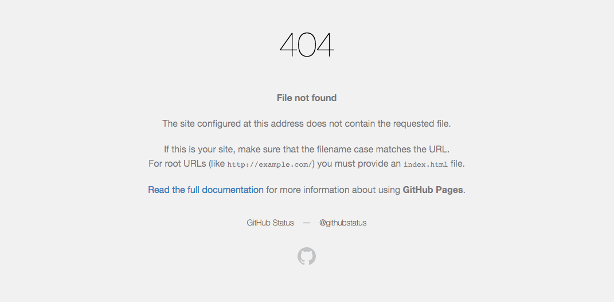

# mkudija.github.io
> [Matthew Kudija's Personal Website](http://matthewkudija.com/)

## License
The content of this website itself is licensed under the [Creative Commons Attribution 3.0 license](https://creativecommons.org/licenses/by/3.0/). The source code used to format and display that content—as well as any code displayed on this website—is licensed under the [MIT license](https://github.com/mkudija/mkudija.github.io/blob/master/LICENSE%20(code).txt). Content and code referenced that was written by others is licenced under the particular licence they chose.

See more on my [About](http://matthewkudija.com/about.html) page.

# How It's Made

## 1. Set Up GitHub Pages
- Setup your `<user>.github.io` repository.
- Under **Settings** > **GitHub Pages** you can enable GitHub Pages and select the source as either the master branch (root) of your repository, or the Docs folder. Select one and commit your website assets to that location (`index.html`, assets, etc.)
- If you have an active website at `<user>.github.io`, enabling GitHub Pages in other repositories on your account will make them visible from your main website. For instance, my website home is [matthewkudija.com](http://matthewkudija.com/), hosted in my [mkudija.github.io](https://github.com/mkudija/mkudija.github.io) repository. My blog is in the [blog](https://github.com/mkudija/blog) repository, and located therefore at [matthewkudija.com/blog](http://matthewkudija.com/blog).


## 2. Download Theme
- Find and download a theme. Some good (free) places to look include:
  - [HTML5UP](https://html5up.net/)
  - [Pelican Themes](https://github.com/getpelican/pelican-themes)
  - Find a website you like and inspect it, or better yet find a site hosted publicly on GitHub pages to view its whole source code.
- Customize theme to your liking.
  - This can be little things like changing the colors and typeface to larger things like adding functionality.
  - You don't need to commit your changes to GitHub to see the results. You can view them locally by right clicking on the file and opening in a web browser. Tip: using Safari you can go to **Develop** > **Enter Responsive Design Mode** to see how your site will look on different screens. This is great for making sure that what you see on a desktop when editing it will work well on mobile.
  - If you get stuck, it's easy to get help. You can hire someone on Fiverr for as little as $5 ($7 with their fee) to fix an issue on your website. I recommend [musebkhalid](https://www.fiverr.com/musebkhalid/create-remix-update-and-recover-web-pages?ref_ctx_id=1ca3bd97-b64d-4042-90b4-70582610f333).
- Alternatively, with a little HTML and CSS you can build a simple website yourself from scratch.

## 3. Set Up Extras
### 404.html
The default 404 page on GitHub pages is this:



If you would like a 404 page to match your theme, you can add a custom [`404.html`](https://github.com/mkudija/mkudija.github.io/blob/master/404.html) to your root directory.

### CNAME
If you want a custom domain (i.e. matthewkudija.com instead of mkudija.github.io), perform the following:
1. Buy the domain from your preferred DNS provider. I use Host Gator.
2. Add a [CNAME](CNAME) file to your directory. This should contain just the domain: `matthewkudija.com`. 
3. Configure the A-record with the DNS provider to point to GitHub pages. I called Host Gator customer service and they got it set up. Refer to the [documentation](https://help.github.com/articles/setting-up-an-apex-domain/).
4. For Hostgator, set nameservers as:
- NS1.LAUNCHPAD.COM 
- NS2.LAUNCHPAD.COM
- NS3.LAUNCHPAD.COM 
- NS4.LAUNCHPAD.COM

#### GitHub Pages HTTPS

Info [here](https://help.github.com/articles/troubleshooting-custom-domains/#https-errors). Set A-records as such:
- 185.199.108.153
- 185.199.109.153
- 185.199.110.153
- 185.199.111.153

### favicon.ico
Create or find a square image to use as your favicon. Go to one of the many favicon generator sites (such as [this](https://realfavicongenerator.net/)) to generate your favicon.

### robots.txt
I added a robots.txt but removed it after seeing that it messed up Google search results.

### sitemap.xml
I added a sitemap to aid in searching (and perhaps eventually get sitelinks on the search result) from [xml-sitemaps.com](https://www.xml-sitemaps.com).

### meta tag
I updated the meta tag to improve search results.

```html
<meta name="description" content="add a description of your site here">
<meta name="keywords" content="add, some, keywords, you, want, here"> 
```

### Google Analytics
Set up [Google Analytics](https://analytics.google.com/analytics/web/) to get your unique tracking ID (mine is `UA-72240498-1`) and then copy the required code in to your HTML pages:

> This is the Global Site Tag (gtag.js) tracking code for this property. Copy and paste this code as the first item into the `<HEAD>` of every webpage you want to track. If you already have a Global Site Tag on your page, simply add the **config** line from the snippet below to your existing Global Site Tag.

```html
<!-- Global Site Tag (gtag.js) - Google Analytics -->
	<script async src="https://www.googletagmanager.com/gtag/js?id=UA-72240498-1"></script>
	<script>
		window.dataLayer = window.dataLayer || [];
		function gtag(){dataLayer.push(arguments);}
		gtag('js', new Date());
		gtag('config', 'UA-72240498-1');
	</script>
```


## 4. Enable Bigfoot Footnotes
See [this commit](https://github.com/mkudija/mkudija.github.io/commit/8f6ed3f882466ee92a2aa00a8afec854b9b390ec)
- to change button appearance, customize class "bigfoot-footnote__button" properties in [`bigfoot-default.css`](assets/css/bigfoot-default.css)
- to change popup appearance, customize class "bigfoot-footnote__content" properties in [`bigfoot-default.css`](assets/css/bigfoot-default.css)


## 5. Update Books
1. write book review in markdown
	* See [easybib](http://www.easybib.com/guides/citation-guides/chicago-turabian/footnotes/) exmple for footnote formatting: `Henry James, The Ambassadors (Rockville: Serenity, 2009), 34-40.` Footnotes in Markdown use this format:
```
"Blah blah blah."[^id] More words and more words.[^id2] Finally, let's add more words

[^id]: Footnote text for id1 goes here...
[^id2]: Footnote text for id2 goes here...
```

2. add cover image to [`images/books/`](images/books/)
3. add data in [`books/md/_content.xlsx`](books/md/_content.xlsx)
4. run [`books/md/_build.py`](books/md/_build.py) which creates an HTML file for each MD file defined in `_content.xlsx`\*
5. commit changes (including newly created html file)

\*Alternatively, individually convert from MD to HTML in the commany line by running [`markdown2.py`](/book-reviews/md/markdown2.py) (See [here](https://github.com/trentm/python-markdown2) for more information about markdown2 from @trentm):

```
python markdown2.py -x footnotes,smarty-pants,cuddled-lists,target-blank-links FNAME.md > FNAME.html
```


## 6. Update Reading
Run [`reading.py`](/reading/reading.py) to covert book list from Markdown to HTML. This also generates a plot.

```
python reading.py
```


## 7. Particle background
- Add particle background from http://jnicol.github.io/particleground/
- Config ~380 in `assets/js/jquery.particleground.js`


<h1 id="examples">Example Websites</h1>
This website is inspired by a number of others, including those below:

- [Knight Lab](https://knightlab.northwestern.edu/), including [Juxtapose for comparing images](https://juxtapose.knightlab.com/) and a [cool book timeline](https://cdn.knightlab.com/libs/timeline3/latest/embed/index.html?source=1wNbJv1Zf4Oichj3-dEQXE_lXVCwuYQjaoyU1gGQQqk4&font=Default&lang=en&start_at_end=true&initial_zoom=2&height=650)
- [Chris Moffitt](http://pbpython.com/)
- [Jake VanderPlas](http://jakevdp.github.io/)
- [Tim Hopper](https://tdhopper.com/)
- [Kieran Healy](https://kieranhealy.org/resources/)
- [Michael Zalewski](http://lcamtuf.coredump.cx/table/)
- [David Robinson](http://varianceexplained.org/r/start-blog/)
- [Gavin Rehkemper](https://gavinr.com/about-gavin-rehkemper/)
- [Daniel Rodriguez](danielfrg.com)
- [Matthew Henderson](http://www.matthen.com/)
- [Joe Hanson](https://www.itsokaytobesmart.com/)
- [Ian Schon](http://ianschon.com/)
- [Brett Victor](http://worrydream.com/)
- [Chris Olah](http://colah.github.io/)
- [John Cook](https://www.johndcook.com/blog/)
- [Jonathan McGlone](http://jmcglone.com/about/)
- [Chris Albon](https://chrisalbon.com/)
- [Jeff Atwood](https://blog.codinghorror.com/about-me/)
- [Duncan Lock](http://duncanlock.net/pages/duncan-locks-resume.html)
- [Matti Vuorre](https://vuorre.netlify.com/)
- [Cody McLain](https://www.codymclain.com/photography/)
- [Justin Ellis](https://jellis18.github.io/)
- [Jeroen Boeye](https://www.jeroenboeye.com/about/)
- [Michael Herman](http://mherman.org/about)
- [Nipun Batra](https://nipunbatra.github.io/blog/2017/Jupyter-powered-blog.html)
- [Jason Davies](https://www.jasondavies.com/)
- [Daniel Rothenberg](http://www.danielrothenberg.com)
- [Dominik Moritz](https://www.domoritz.de/)
- [Kanit "Ham" Wongsuphasawat](https://kanitw.github.io/)
- [Michael Fogleman](https://www.michaelfogleman.com/)
- [Vicki Boykis](http://veekaybee.github.io/)
- [Matthew Brehmer](https://mattbrehmer.github.io/)
- [Matthew McAteer](https://matthewmcateer.me/bookshelf/)
- [David Sousa-Rodrigues](https://www.sixhat.net/)
- [Julian](https://julian.digital/about)


# Other Sites I've Built*
*Built as in put together from a lot of other people's work and a little fiddling myself
- [tappertoolco.com](http://tappertoolco.com/)
- [kudijakitchen.com](http://kudijakitchen.com/)
