# A Crash Course in Causality
*[A Crash Course in Causality: Inferring Causal Effects from Observational Data - Welcome and Introduction to Causal Effects | Coursera](https://www.coursera.org/learn/crash-course-in-causality/home/week/1)*

by [Dr. Jason Roy](https://pets.rutgers.edu/people/jason-roy/) from [UPenn Center for Causal Inference](https://www.cceb.med.upenn.edu/cci)

[Root Data Science Book Club Notes | Confluence](https://joinroot.atlassian.net/wiki/spaces/DS/pages/2104918017/Data+Science+Book+Clubs)

 
<i>Contents</i>

<!-- MarkdownTOC autolink="true" -->

- [Welcome and Introduction to Causal Effects](#welcome-and-introduction-to-causal-effects)
	- [Confusion over causality](#confusion-over-causality)
	- [Potential outcomes and counterfactuals](#potential-outcomes-and-counterfactuals)
	- [Hypothetical interventions](#hypothetical-interventions)
		- [Causal effects](#causal-effects)
	- [Causal assumptions](#causal-assumptions)
	- [Stratification](#stratification)
	- [Incident user and active comparator designs](#incident-user-and-active-comparator-designs)
- [Confounding and Directed Acyclic Graphs \(DAGs\)](#confounding-and-directed-acyclic-graphs-dags)
	- [Confounding](#confounding)
	- [Causal graphs](#causal-graphs)
	- [Relationship between DAGs and probability distributions](#relationship-between-dags-and-probability-distributions)
	- [Paths and associations](#paths-and-associations)
	- [Conditional independence \(d-separation\)](#conditional-independence-d-separation)
	- [Confounding revisited](#confounding-revisited)
	- [Backdoor path criterion](#backdoor-path-criterion)
	- [Disjunctive cause criterion](#disjunctive-cause-criterion)
- [Matching](#matching)
	- [Observational studies](#observational-studies)
	- [Overview of matching](#overview-of-matching)
	- [Matching directly on confounders](#matching-directly-on-confounders)
	- [Greedy \(nearest-neighbor\) matching](#greedy-nearest-neighbor-matching)
	- [Optimal matching](#optimal-matching)
	- [Assessing balance](#assessing-balance)
	- [Analyzing data after matching](#analyzing-data-after-matching)
	- [Sensitivity analysis](#sensitivity-analysis)
	- [Data example in R](#data-example-in-r)

<!-- /MarkdownTOC -->

# Welcome and Introduction to Causal Effects
## Confusion over causality
- **Spurious Correlation**: causally unrelated variables that might happen to be highly correlated with each other over some period of time (i.e. divorce correlated with margarine consumption)
- **Anecdotes**: might be confident in our anecdotes but might not be correct
- **Science reporting**: this is "linked" to that: linked is ambiguous
- Causal inference or causal modeling attempts to clear these problems up by:
	- formal definitions of causal effects
	- assumptions necessary to identify causal effects from data
	- sensitivity analysis to determine impact of violations of assumptions on conclusions
- Course focuses on **observational studies** and **natural experiments**
- **Assumptions**: requires making untestable assumptions (can't check with the data)

## Potential outcomes and counterfactuals
- Treatment $A$ on outcome $Y$
- $Y^a$ is the outcome observed if treatment is $a$
- **Counterfactual outcomes** are ones that would have been observed had the treatment been different
	- if treatment was $A=1$, counterfactual is $Y^0$

## Hypothetical interventions
- **Intervention**: causal effects of variables that can be manipulated
- **Immutable variables**: variables you can't manipulate (race/gender/age)
	- but can do creative things like different name on resume, or focus on outcome of something you can control (like decision to have surgery rather than obesity)
- This course focuses on **interventions** since they are actionable
- **Causal effect** occurs on $Y$ if $Y^1 \ne Y^0$
- The **Fundamental Problem of Causal Inference** is that we can only observe one potential outcome for each person, so need to look at a population

### Causal effects
- **Average Causal Effect**: hypothetical difference between the whole population getting different treatments
	- $ACE = E(Y^1-Y^0)$
	- Example: suppose $E(Y^1-Y^0)=-0.1$, meaning if 1000 people were to have surgery, 100 fewer would have complications with this treatment
- Conditioning (given, or conditional on a variable):
	- $E(Y^1-Y^0) \ne E(Y|A=1) - E(Y|A=0)$
	- $E(Y|A=1)$: expected value of $Y$ given $A=1$, this restricts to a subpopulation of people who got $A=1$
	- $E(Y^1)$ is the mean of the whole population treated with $A=1$
	- Populations may be different in important ways
- We might be interested in other causal effects:
	- $E(Y^1/Y^0)$: Causal relative risk
	- $E(Y^1-Y^0|A=1)$: Causal effect of treatment on the treated population
	- $E(Y^1-Y^0|V=v)$: Average causal effect in a subpopulation
- *How do we use observed data to link observed outcomes to potential outcomes?*
	- Need to make assumptions, focus of this course

## Causal assumptions
- **Identifiability** requires making untestable, causal assumptions
	- assumptions are about the observed data: $Y$, $A$, and $X$
- **Stable Unit Treatment Value Assumption (SUTVA)**
	- Units do not interfere with each other: treatment assignment of one unit does not affect that outcome of another unit
	- One version of treatment
- **Consistency**
	- The potential outcome under treatment $A=a$, $Y^a$ is equal to the observed outcome if the actual treatment received is $A=a$
	- Links potential outcomes to observed outcomes
- **Ignorability** (no unknown measures confounder assumptions)
	- Given pre-treatment covariates $X$, treatment assignment is independent from the potential outcomes: $Y^0,Y^1 \mathbin{\perp\kern-11mu\perp} A|X$ (read as: potential outcomes $Y^0$ and $Y^1$ are independent of treatment variable $A$ conditional on $X$)
	- Among people with the same values of $X$, we can think of treatment $A$ as being randomly assigned
	- Random = independent of outcomes, might not be random in another sense
- **Positivity**
	- For every set of values for $X$, treatment assignment was not deterministic: $P(A=a|X=x)>0$ for all $a$ and $x$
	- Helps define who the population of interest is, excludes those who could never receive the treatment
- **Example**
	- $E(Y|A=a,X=x)$ involves only observed data ($Y$, $A$, and $X$)
	-  $E(Y|A=a,X=x) = E(Y^a|A=x,X=x)$ by **consistency**, goes from just observed data ($Y|A=a$) to something that involves outcomes ($Y^a$)
	- $E(Y|A=a,X=x) = E(Y^a|X=x)$ by **ignorability**, allows us to drop the conditioning on treatment, conditioning on $A$ doesn't provide any additional information
	- For a marginal causal effect, we can average over $X$

## Stratification
- Stratification aka Standardization: stratify on important variables and average over the distribution of those variables
	- composed of *conditioning* and *marginalizing*, or *stratifying* and then *averaging*, weighted by the probability (size)
- Suppose single categorical $X$ variable, then average over the distribution of $X$, a standardized mean which is the average potential outcome: 
	- $E(Y^a)=\sum_{x}{E(Y|A=a,X=x)P(X=x)}$

**Example**: treatment Saxa for MACE:

| Treatment | MACE=yes | MACE=no | Total |
| --------- | -------- | ------- | ----- |
| Saxa=yes  | 350      | 3650    | 4000  |
| Saxa=no   | 500      | 6500    | 7000  |

- Probability of MACE given Saxa=yes: $350/4000=0.088$
- Probability of MACE given Saxa=no: $500/7000=0.071$
- → raw data makes Saxa look worse, but might be because it was assigned to patients who were worse off initially
- So we stratify/standardize on the $X$ variable (prior OAD use):

Prior OAD use=no:

| Treatment | MACE=yes | MACE=no | Total |
| --------- | -------- | ------- | ----- |
| Saxa=yes  | 50       | 950     | 1000  |
| Saxa=no   | 200      | 3800    | 4000  |

- Probability of MACE given Saxa=yes: $50/1000=0.050$
- Probability of MACE given Saxa=no: $200/4000=0.050$

Prior OAD use=yes:

| Treatment | MACE=yes | MACE=no | Total |
| --------- | -------- | ------- | ----- |
| Saxa=yes  | 300      | 2700    | 3000  |
| Saxa=no   | 300      | 2700    | 3000  |

- Probability of MACE given Saxa=yes: $300/3000=0.100$
- Probability of MACE given Saxa=no: $300/3000=0.100$
- → in either group the risk of MACE is the same regardless of Saxa use
- Next compute mean potential outcome for Saxa:
	- $E(Y^{saxa}) = E(Y|A=saxa,X=OAD_{yes})P(OAD_{yes})+E(Y|A=saxa,X=OAD_{no})P(OAD_{no})$
	- $E(Y^{saxa}) = (300/3000)(6000/11000)+(50/1000)(5000/11000)$
	- $E(Y^{saxa}) = 0.077$ is the probability of MACE if everyone had been assigned Saxa
- Next compute mean potential outcome for alternate
	- $E(Y^{not-saxa}) = (300/3000)(6000/11000)+(200/4000)(5000/11000)$
	- $E(Y^{not-saxa}) = 0.077$ is the probability of MACE if everyone had *not* been assigned Saxa (same for both groups)
- Challenges: often you need many $X$ variables to achieve ignorability and will have many empty cells in this example, so need alternatives to standardization (matching, inverse probability of treatment weighting, propensity score methods, instrumental variable methods—cf. *[[2021-04-16-Business Data Science#Chapter 5 Experiments|Business Data Science]]*)

## Incident user and active comparator designs
- **Incident user design** (aka new user design): restrict the treated population to those newly initiating treatment (so as to not confound people who tried the treatment in the past and are still benefitting from the treatment)
	- or realign time index for each user for when they started treatment
- **Active comparator design**: include people with similar treatments in the treatment group: leads to less confounding but makes the causal inference apply to other treatments
- Can combine incident user and active comparator designs

# Confounding and Directed Acyclic Graphs (DAGs)

## Confounding
- Related to ignorability assumption: if we make the treatment population homogeneous enough we can think of the treatment assignment as ignorable
- **Confounders** are variables that affect both treatment and the outcome
- Confounder control
	- Identify a set of variables $X$ that will make the ignorability assumption hold and ensure random treatment assignment
	- Causal graphs help us choose these variables

## Causal graphs
- Causal graphs help us identify which variables we need to control for and make our assumptions explicit
- Directed graph: $A \rightarrow Y$, $A$ affects $Y$
- Undirected graph: $A — Y$, $A$ and $Y$ are related
- $A$ and $Y$ are *nodes* or *vertices* or variables
- Links between notes are *edges*
- Variables connected by an edge are *adjacent*
- A *path* is a way to get from one vertex to another by traveling along edges
- **Directed Acyclic Graphs**
	- no undirected paths
	- no cycles

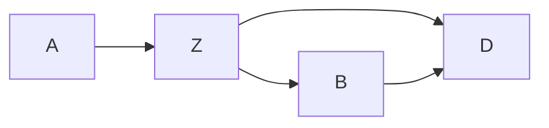

## Relationship between DAGs and probability distributions
- DAG tells us which variables are independent, conditionally independent, etc.
- Example: $C, D \rightarrow A \rightarrow B$
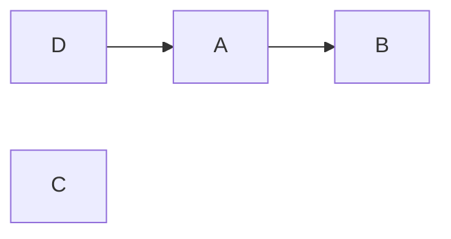
- this example implies:
	- $P(C|A,B,D)=P(C)$, C is independent of all variables
	- $P(B|A,C,D)=P(B|A)$, $B \mathbin{\perp\kern-11mu\perp} D, C|A$,  i.e. $B$ only depends on $A$
	- $P(B|D) \ne P(B$), $B$ and $D$ are marginally dependent
	- $P(D|A,B,C)=P(D|A)$
- Example:
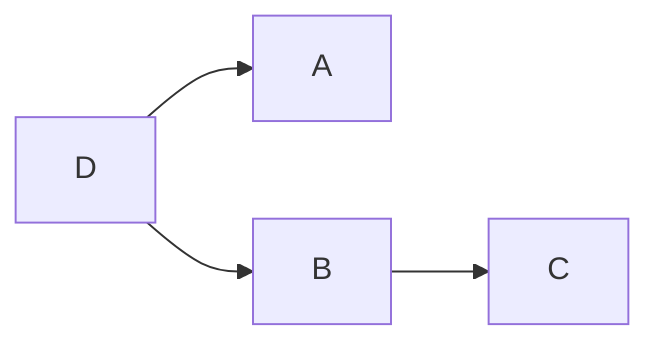
- this example implies:
	- $P(A|B,C,D)=P(A|D)$
	- $P(D|A,B,C) = P(D|A,B)$
- Example:
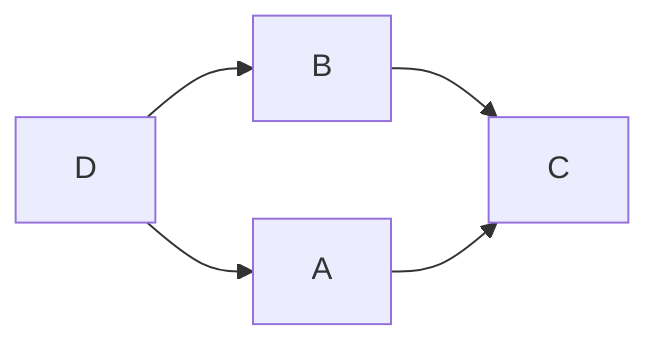
- this example implies:
	- $P(A|B,C,D)=P(A|C,D)$
	- $P(D|A,B,C)=P(D|A,B)$
- **Decomposition of Joint Distribution**
	- start with roots (nodes with no parents)
	- proceed down descendent line
- Example:

- this example implies:
	- $P(A,B,C,D)=P(C)P(D)P(A|D)P(B|A)$, gives joint distribution implied by the DAG
- Example:

- this example implies:
	- $P(A,B,C,D)=P(D)P(A|D)P(B|D)P(C|B)$
- The probability function and the DAG are **compatible**
- DAGs that are compatible with a probability function are not necessarily unique:
	- For example, $A \rightarrow B$ and $B \rightarrow A$
	- $P(A,B) \ne P(A)P(B)$ is true for both

## Paths and associations
- Types of paths
	- **Forks**: $D \leftarrow E \rightarrow F$
	- **Chains**: $D \rightarrow E \rightarrow F$
	- **Inverted Forks**: $D \rightarrow E \leftarrow F$
- If nodes are on the ends of a path, they are associated via the path 
	- if some information flows to both of them
	- if information from one makes it to the other
	- i.e. $D \leftarrow E \rightarrow F$ implies that $D$ and $F$ are not independent
	- i.e. $D \rightarrow E \leftarrow F$ implies that $E$ is a *collider*: information does not flow from $E$ to either $D$ or $F$

## Conditional independence (d-separation)
- **Blocking**: paths can be blocked by conditioning on nodes in the path
	- Blocking on a chain: $A \rightarrow G \rightarrow B$, if we condition on $G$, we block the path from $A$ to $B$
	- Blocking on a fork: $A \leftarrow G \rightarrow B$, if we condition on $G$, the path from $A$ to $B$ is blocked
- **Colliders** are the opposite condition
	- $A \rightarrow G \leftarrow B$, if we condition on $G$ you create an association between $A$ and $B$
	- Example: Suppose $A$ and $B$ is on/off switches, and $G$ is whether the lightbulb is lit, $G$ only lit if both $A$ and $B$ are on
		- $A$ and $B$ are independent
		- But $A$ and $B$ are dependent, given G
- Before conditioning on $G$:
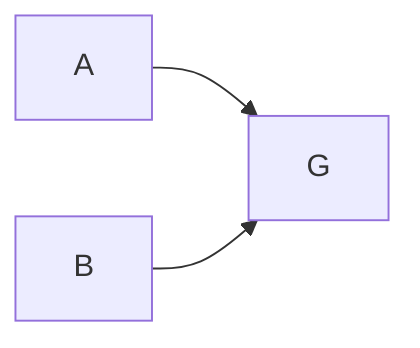
- After conditioning on $G$ (if you block $G$ you open up a new path between $A$ and $G$):
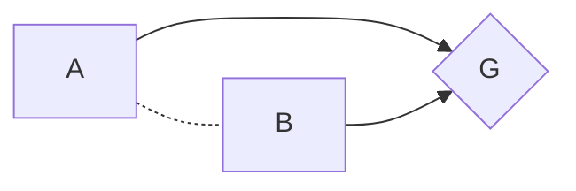
- A path is **d-separated** (independent) by a set of nodes $C$ (nodes we will control for) if:
	- it contains a chain and the middle part is in $C$
	- if it contains a fork and the middle part is in $C$
	- if it contains an inverted fork and the middle part is not in $C$, nor are any descendants of it
- Two nodes are **d-separated** by $C$ if $C$ blocks every path between them
	- recall the **Ignorability** assumption: the motivation is to identify variables that create conditional independence between $A$ and the potential outcomes

## Confounding revisited
- **Confounders** are variables that affect both the treatment and outcome
- In this example, $X$ is confounding between $A$ and $Y$
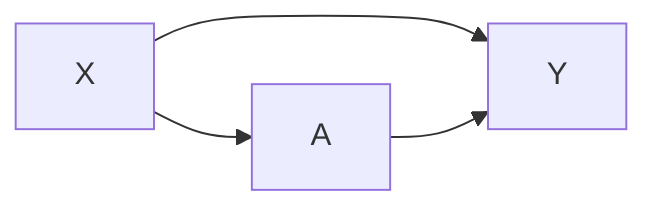
- In this example, $V$ is confounding between $A$ and $Y$, indirectly
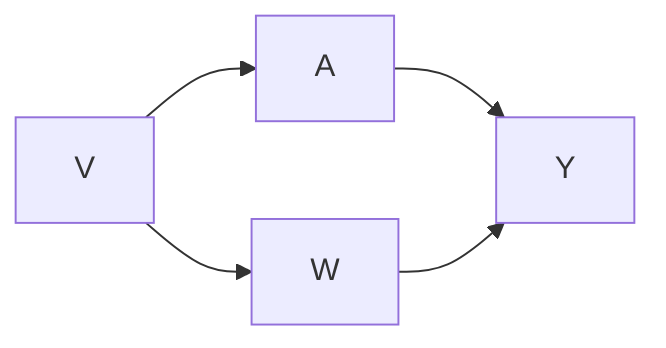
- A **Frontdoor path** from $A$ to $Y$ begins with an arrow from A
	- $A \rightarrow Y$ and $A \rightarrow Z \rightarrow Y$ are front doors because direction of arrow out of A
	- don't worry about frontdoor paths because they show affects of treatment (don't want to block or control for anything on a frontdoor path, i.e $Z$ above)
	- But in a **causal mediation analysis** you would want to quantify the effect of treatment through intermediate variables, i.e. $Z$
- **Backdoor paths** from treatment $A$ to $Y$ travel through $A$, confound the relationship between $A$ and $Y$ and we want to block these
	- In $A \leftarrow X \rightarrow Y$, we want to separate out treatment effect from confounding effect of $X$
	- if we block all backdoor paths then we have **Ignorability**

## Backdoor path criterion
- To use the backdoor path criterion, you need to know and use the DAG
- A set of variables $X$ is sufficient to control for confounding if:
	- it blocks all backdoor paths from treatment to outcome
	- it does not include any descendants of treatment

- Example above: one backdoor path from $A$ to $Y$, so need to block $V$, or you could control for $W$, or you could control for both $V$ and $W$
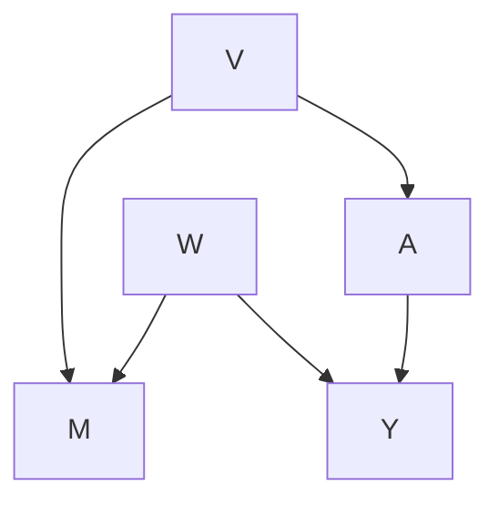
- Example above: the backdoor path is clocked the the collider $M$ so no confounding
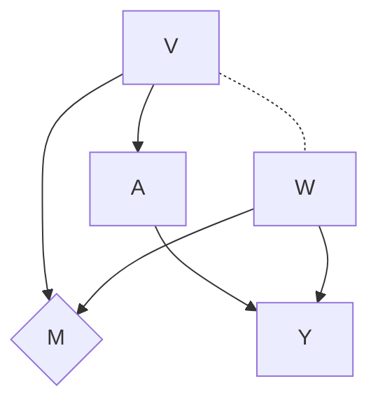
- Example above: But if you control for M, you open a path between $V$ and $W$, so the variables to control for confounding include: {},{V},{W},{M,W},{M,V},{M,V,W} but not just {M}
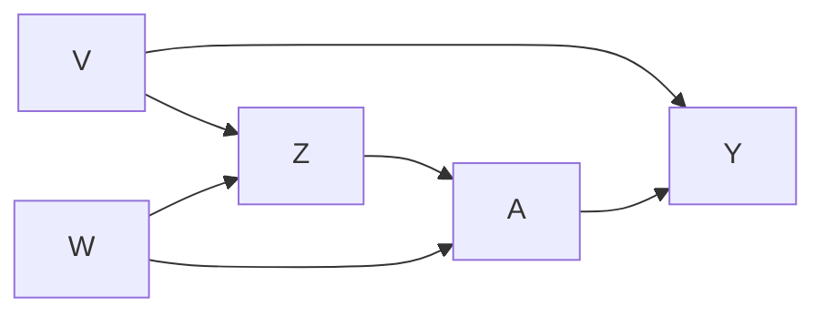
- Example above: two backdoor paths from $A$ to $Y$
	- $A \leftarrow Z \leftarrow V \rightarrow Y$
		- no colliders, so control for either Z or V
	- $A \leftarrow W \rightarrow Z \leftarrow V \rightarrow Y$
		- $Z$ is a collider, so controlling for $Z$ opens a path between $V$ and $W$, can block this with {V}, {W}, {Z,V}, {Z,W}
	- The following sets are sufficient to control for confounding:
		- {V}, {V,Z}, {Z,W}, {V,Z,W}, but not {Z} or {W} alone

## Disjunctive cause criterion
- If you know less information than the whole DAG, you can use the **Disjunctive cause criterion**: control for all (observed) causes of the exposure, the outcome, or both
	- don't always select the smallest set of variables
	- but it is conceptually simpler
- Example:
	- Given:
		- Observed pre-treatment variables: {M,W,V}
		- Unobserved pre-treatment variables: {$U_1, U_2$}
		- We know that W and V are causes of A, Y, or both
		- We know that M is not a cause of either A or Y
	- Could use everything: {M,W,V}
	- Could use the disjunctive cause criterion: {W, V}
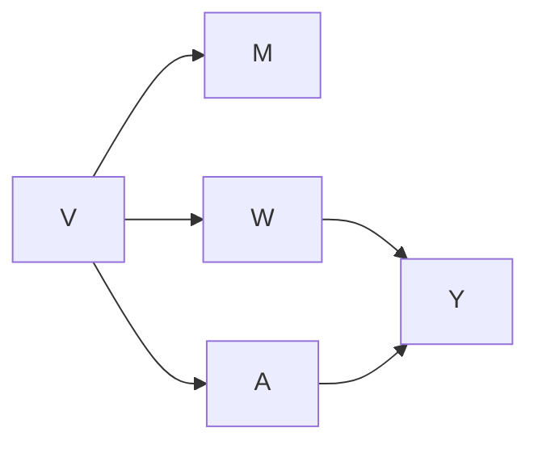
-  Example above:
	- use all pre-treatment variables {M, W, V}
	- use variables based on DCC {W,V}

- Example above:
	- use all pre-treatment variables {M, W, V}
	- use variables based on DCC {W,V}
- There are situations where there are no variables you can control for to satisfy the backdoor path criterion

Quiz:

1. ==3==, ==2==, ==4==, ==1==, ==0==
2. ==2==, 1
3. yes
4. no
5. 2
6. ==2==, ==3==, ==1==, ==0==, 4
7. 2
8. b & g
9. yes
10. ==c,b,g,h==, ==g,h==, ==g,b==, b,g,h
11. no

# Matching

## Observational studies
- Randomized trial: randomly select people for treatment, distribution of $X$ is the same in both treatment groups (balance)
- Observational study: distribution of $X$ will differ between treatment groups
- **Matching**: attempt to make observational study more like a randomized trial by matching individual in the treated group ($A=1$) to individual in the control group ($A=0$) on the covariates $X$

## Overview of matching
- Single covariate: find best matches you can and ignore non-matches
- Many covariates: can't match exactly, but try to find stochastic balance
- 

## Matching directly on confounders

## Greedy (nearest-neighbor) matching

## Optimal matching

## Assessing balance

## Analyzing data after matching

## Sensitivity analysis

## Data example in R

---
Created: [[2022-05-23-Mon]]
Updated: <%+ tp.file.last_modified_date("YYYY-MM-DD-ddd") %>
