# [[Bible Translations|Bible Translation]] Chart

```mermaid
graph LR

orig(Original Languages)
kjv(KJV 1611)
rv(Revised Version 1885)
asv(ASV 1901)
rsv(RSV 1952)
rsvce(RSV-CE 1966)
rsv2ce(RSV-2CE 2006)
nrsv(NRSV 1989)
nrsvce(NRSV-CE 1991)
nrsvue(NRSVue 2022)
nrsvuece(NRSVue-CE 2025)
nkjv(NKJV 1982)
esv(ESV 2001)
esv16(ESV 2016)
esv25(ESV 2025)
esvce(ESV-CE 2018)
nab(NAB 1970)
nabre(NABRE 2011)
cab(CAB 2027)
niv(NIV 1978)
niv84(NIV 1984)
niv11(NIV 2011)
v(Vulgate 400)
nv(New Vulgate 1979)
nv86(New Vulgate 1986)
douay(Douay 1610)
challoner(Challoner 1752)
confraternity(Confraternity 1941)
na(NASB 1971)
nas(NASB 1995)
lsb(LSB 2021)
nasb(NASB 2020)
lbj(La Bible de Jérusalem 1956)
jb(JB 1966)
njb(NJB 1985)
rnjb(RNJB 2019)
tlb(TLB 1971)
tlbce(TLB-CE 1976)
nlt(NLT 1996)
nltce(NLT-CE 2016)
alv(ALV 2016)
ctsncb(CTS NCB 2007)
cbpcncb(CBPC NCB 2019)
csv(CSV 2022+?)

classDef ct fill:lightBlue
classDef pt fill:lightGreen
classDef ec fill:pink

Catholic>Catholic]:::ct
Protestant>Protestant]:::pt
Ecumenical>Ecumenical]:::ec

orig --> nab:::ct
orig --> v:::ct
orig --> kjv:::pt
orig --> na
nab --> nabre:::ct
nabre --> cab:::ct
v --> nv:::ct
v --> douay:::ct
douay --> challoner:::ct
kjv --> challoner
challoner --> confraternity:::ct
confraternity --> nab
nv --> nv86:::ct
kjv --> rv:::pt
kjv --> nkjv:::pt
kjv --> asv:::pt
asv --> rsv:::ec
rsvce --> rsv2ce:::ct
rsv --> nrsv:::ec
nrsv --> nrsvue:::ec
nrsv --> nrsvce:::ct
nrsvue --> nrsvuece:::ec
rsv --> rsvce:::ct
rsv --> esv:::pt
esv --> esv16:::pt
esv16 --> esv25:::pt
esv --> esvce:::ct
asv --> alv:::pt
asv --> na:::pt
na --> nas:::pt
nas --> nasb:::pt
nas --> lsb:::pt
orig --> lbj:::ct
orig --> jb:::ct
lbj --> jb
jb --> njb:::ct
jb --> ctsncb:::ct
njb --> rnjb:::ct
orig --> niv:::pt
orig --> tlb:::pt
tlb --> tlbce:::ct
tlb --> nlt
orig --> nlt:::pt
nlt --> nltce:::ct
niv --> niv84:::pt
niv84 --> niv11:::pt
orig --> cbpcncb:::ct
orig --> csv:::ct

click alv "https://www.bibliotheca.co/translation" _blank
click ctsncb "https://en.wikipedia.org/wiki/Catholic_Truth_Society" _blank
click cbpcncb "https://www.biblegateway.com/versions/New-Catholic-Bible-NCB-Bible/" _blank


```

**Reference**
- See the two charts alongside my notes for *[[2025-07-06-The King James Bible-A Short History from Tyndale to Today|The King James Bible-A Short History from Tyndale to Today]]* giving more detail to: 1) the origins of the KJV, and 2) the development of the KJV since the 1611 first edition
- [EvangelicalBible.com - English Bible Overview](https://evangelicalbible.com/wp-content/uploads/2019/05/english_bible_history5.19.png)

---
Created: [[2023-04-06-Thu]]
Updated: `=dateformat(this.file.mtime, "yyyy-MM-dd-ccc")`
