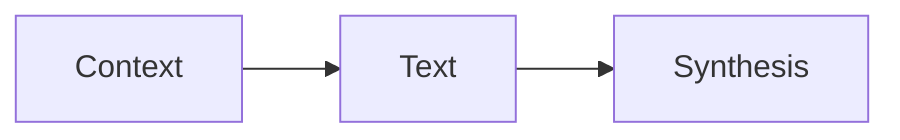
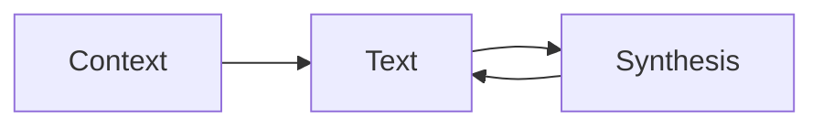
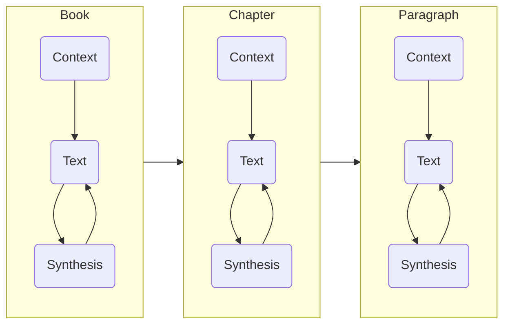

## [The Fractal-Summary Method: How to Digest Great Books](https://johnathanbi.com/writing/fractal-summary-method) by [[Johnathan Bi]]

Many great books are so packed with insight and nuance that synthesis of the text must come long before finishing the work. The **Fractal-Summary Method** of digesting great books applies a basic process of *Context → Text → Synthesis* to the various units of the work.

1. **Context:** Before reading the text build your awareness of the author's perspective and argument. I do this primarily through two means:
	- Personal conversations 
	- If I come across some context for a work I plan to study in the future, I note the context with a link to the work (creating it if it does not yet exist), allowing me to follow the backlinks for a work as a means of building context when I am ready to study it.
2. **Text:** Actively engage with the text itself
3. **Synthesis:** Immediately after reading the text, synthesize the argument and main points into your notes, forcing you to be actively engaged and giving you a document to quickly review

Actively engaging with the text and synthesizing while you read (rather than at the end of the work) is an alternating process.

This process is then applied to the various units of the work, terminating at the smallest unit you choose based on the structure and complexity of the work and the time you plan to invest. For a complex or difficult work this may even be at the sentence level.

---
Created: [[2023-01-16-Mon]]
Updated: <%+ tp.file.last_modified_date("YYYY-MM-DD-ddd") %>
