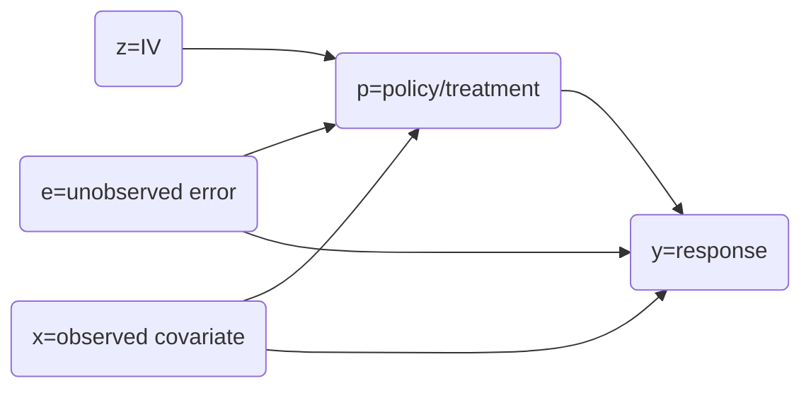
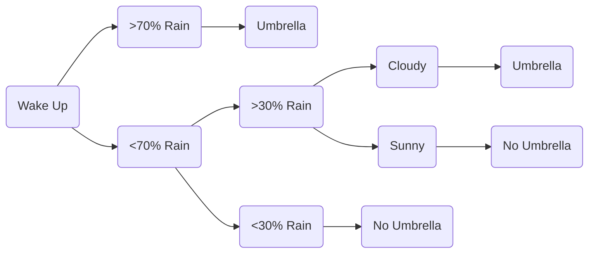

# [*Business Data Science: Combining Machine Learning and Economics to Optimize, Automate, and Accelerate Business*](https://www.mhprofessional.com/business-data-science-combining-machine-learning-and-economics-to-optimize-automate-and-9781260452778-usa) by Matt Taddy

`(New York: McGraw Hill, 2019), 331`

 
<i>Contents</i>

<!-- MarkdownTOC autolink="true" -->

- [Resources](#resources)
- [Introduction](#introduction)
- [Chapter 1: Uncertainty](#chapter-1-uncertainty)
- [Chapter 2: Regression](#chapter-2-regression)
- [Chapter 3: Regularization](#chapter-3-regularization)
- [Chapter 4: Classification](#chapter-4-classification)
- [Chapter 5: Experiments](#chapter-5-experiments)
- [Chapter 6: Controls](#chapter-6-controls)
- [Chapter 7: Factorization](#chapter-7-factorization)
- [Chapter 8: Text as Data](#chapter-8-text-as-data)
- [Chapter 9: Nonparametrics](#chapter-9-nonparametrics)
- [Chapter 10: Artificial Intelligence](#chapter-10-artificial-intelligence)

<!-- /MarkdownTOC -->

### Resources

	<strong>If Latex does not render, you can download a PDF of these notes <a href="https://github.com/mkudija/mkudija.github.io/blob/master/reading-notes/_md/2021-04-16-Business-Data-Science.pdf">here</a>.</strong>

- *The author's data and R scripts for the book is on [GitHub](https://github.com/TaddyLab/bds) (see also code for [MBA course](https://github.com/TaddyLab/MBA)).*
- *My code to accompany these notes is on [GitHub](https://github.com/mkudija/taddy-business-data-science).*
- *Amazon [author interview](https://www.amazon.science/business-data-science-is-a-lot-more-than-just-making-predictions-matt-taddy) discussing concepts from the book.*

## Introduction
*Summary: Our goal is to produce interpretable models that translate data into insights for decision-making. The modern methods of business data science are characterized by the addition of big data and machine learning to classical statistical and economic methods.*

*Code for this section is [here](https://github.com/mkudija/taddy-business-data-science/tree/main/00-introduction).*

- The Goal: produce an *interpretable* model that translates raw data into information relevant to decision-making; project information into a low-dimensional space that contains key insights for decision making (3-4)
  - Motivating example: visualized CAPM outputs give a richer view for decisions making than just a messy plot of returns (Figure I.3, [reproduced here](https://github.com/mkudija/taddy-business-data-science/blob/main/0-introduction/3-stock-returns/0-introduction_stock-returns.ipynb))
- "Modern methods" are distinguished by *big data* and *machine learning*
  - Data Science ≈ statistics + BD + ML
  - Business Data Science ≈ statistics + BD + ML + economics + econometrics + business context
- **Big Data**: data can be "big" in terms of both *volume* and *complexity*
  - Big (*volume*) Data is where the scale swamps RAM and requires piping by data engineers
  - Big (*complexity*) Data is big *dimension* data where the assumptions of classical statistics break down ("big *p*" problems)
- **[[Machine Learning]]**: automatically build *predictions* from complex data
  - Key techniques include **lasso regularized regression**, **random forests**, **neural networks** (295)
  - Focus is to maximize predictive performance on out-of-sample data
  - Limited *structural* interpretability: black box for making predictions when the future follows the same patterns as the past (with the implicit warning about the danger of changing patterns)
  - *Structural analysis* refers to building analytically from theory, as compared with the pragmatic, black-box *prediction* of machine learning
  - Good data science then is having an overall understanding of the domain to know the appropriate *prediction* tasks to throw at ML, and the *structural* problems to address with classical economics and statistics
  - "A policy-maker who can deploy ML to solve the many prediction tasks that they face will be able to automate and accelerate their decision process." (7)
  - ML prediction tools should be part of a larger system with goals beyond pure prediction
- **Computation**
  - This book uses R, but the key point is that "anyone working with data will need to continue learning and updating their computational (and methodological) skills"; best way to learn is by doing (11)

## Chapter 1: Uncertainty
*Summary: This chapter introduces **nonparametric** ("data driven", frequentist) and **parametric** ("theoretical", Bayesian) approaches to quantifying uncertainty. **The Bootstrap** is a flexible nonparametric method that works by resampling with replacement. The **Benjamini-Hochberg** algorithm provides a method of selecting variables by ranked p-value based on the desired false discovery rate. Finally, we learn about the **Bayesian** framework for combining assumptions with evidence.*

- **Parametric** vs **Nonparametric**
  - **Parametric**: "theoretical"
    - conditional on assumed true model
  - **Nonparametric**: "data driven"
    - allows for model misspecification
  

| Parametric               | Nonparametric                          |
| ------------------------ | -------------------------------------- |
| Quantifies uncertainty   | Quantifies uncertainty                 |
| "Theoretical"            | "Data-driven"                          |
| Bayesian                 | Frequentist                            |
| Assume CLT/Gaussian      | Use the Bootstrap                      |
| Specify distribution     | More flexible                          |
| "Ideal" for theory       | "Ideal" for decision-making            |
| High-dimensional data ok | Requires low-dimensional data $n >> p$ |

- **Frequentist** vs **Bayesian**
  - **Frequentist**: classical uncertainty
    - *"If I were able to see a new sample of data generated by the same processes and scenarios as my current data, how would my estimates change?"*
  - **Bayesian**: mathematical framework of beliefs (more below)
    - *"If you believe A and then you observe B, you should update your beliefs to C."*
- **Central Limit Theorem** (CLT): the average of independent random variables becomes normally distributed if your sample size is large enough
- **The Bootstrap**: uses resampling (*with replacement*) from your current sample to mimic the sampling distribution and introduce variability
  - use the Bootstrap because theoretical Gaussian distributions derived from the CLT are not valid for many complex settings (i.e. number of model parameters large relative to number of observations)
  - the Bootstrap will work in many settings where theory is either unavailable or incorrect (if the Bootstrap fails, there probably isn't a good theoretical replacement)
  - an alternative is the **Parametric Bootstrap**: generate new data by drawing from a fitted model (the results are sensitive to how well the model represents reality, but this is a practical option when more robust procedures are impossible)
- ***p*-values**: represents how rare or strange your sample would be if the null hypothesis is true
  - the proportion of times that you would wrongly reject your safe null if the test statistic you've observed is enough to lead you to adopt the alternative
  - measures the probability mass in the tails past your observed test statistic
- **Benjamini-Hochberg (BH) FDR Control**: controls your false discovery rate (FDR) by defining a cutoff on the ranked list of *p*-values from your model
  - $FDR=\mathop{\mathbb{E}} \left[ \frac{FalsePositives}{TestsCalledSignificant} \right]$
  - Select your target $FDR$ of $q$, and keep all *p*-values such that $p \leq q\frac{k}{N}$
  - Gives a decent (often conservative) guess at FDR
- **Bayesian Inference**: the mathematical framework of beliefs
  - characterizes probabilities over models and parameters by appealing to the idea of subjective beliefs rather than repeated trials
  - quantification of risks and expected rewards is inherently Bayesian
  - "If you believe *A* and then you observe *B*, you should update your beliefs to *C*."
  - provides a framework for combining *assumptions* with *evidence*
  - mechanically works with combination of *prior distributions* and *likelihood* (the probability of the data you have observed given a fixed set of mode parameters)
  - inherently *parametric* since you specify a model and then update view of uncertainty based on new data

## Chapter 2: Regression
*Summary: The basic linear regression model (and its logistic counterpart for binary response) are key data science tools. This chapter provides details and examples of their use, along with uncertainty estimation using nonparametric methods such as the bootstrap.*

*Code for this chapter is [here](https://github.com/mkudija/taddy-business-data-science/tree/main/02-regression).*
- **Linear models** work with *averages* and *lines*: consider simple linear regression of the form $y = \alpha + x\beta$, or logarithmic: $\log(y) = \alpha + \beta \log(x) + \epsilon$
	- The log-log model is intuitive: $y$ increases by $\beta$% for every 1% increase in $x$, where $\beta$ is the *elasticity*
- This is how to understand the coefficients of the `glm` object:
	- `reg = glm(log(sales) ~ log(price) + brand, data=data)`
	- `beta <- coef(reg)`
	-   `beta[1]` = $\alpha$ (intercept for base: `brand=dominicks`)
	-   `beta[2]` = $\beta$ (slope)
	-   `beta[3]` = $\alpha_{mm}$ (incremental intercept for `brand=minute.maid`)
	-   `beta[4]` = $\alpha_{t}$ (incremental intercept for `brand=tropicana`)
-   This is how to understand the coefficients of the `glm` object with interactions:
	-   `reg_interact = glm(log(sales) ~ log(price)*brand, data=data)`
	-   `beta <- coef(reg_interact)`
	-   `beta[1]` = $\alpha$ (intercept for base: `brand=dominicks`)
	-   `beta[2]` = $\beta$ (slope for base: `brand=dominicks`)
	-   `beta[3]` = $\alpha_{mm}$ (incremental intercept for `brand=minute.maid`)
	-   `beta[4]` = $\alpha_{t}$ (incremental intercept for `brand=tropicana`)
	-   `beta[5]` = $\beta_{mm}$ (incremental slope for `brand=tropicana`)
	-   `beta[6]` = $\beta_{t}$ (incremental slope for `brand=tropicana`)
- **Logistic Regression** *(page 50-53)* uses the *logit* link function to scale probabilities between 0 and 1:
	- $p(y=1|x) = \frac{e^{x' \hat{\beta}}}{1 + e^{x' \hat{\beta}}}$
	- Logistic regression is a linear model for log odds (where odds = probability it happens over probability it doesn't):
	- $\log \left[ \frac{p}{1-p} \right] = \beta_{0} + \beta_{1}x_{1}... + \beta_{p}x_{p}$
	 - Use `family='binomial'` for logistic regression
	 - "`y ~ .`" to regress y on to all variables in the data
	- Interpreting coefficients: $e^{\beta k}$ is the *multiplicative effect for a unit increase in $x_{k}$ on the odds for the event* $y=1$.
	- When predicting, call `type='response'` to run predictions through the logit link as $e^{x' \hat{\beta}} / (1 + e^{x' \hat{\beta}})$.
- **Deviance and Likelihood** *(page 53-57)*
	- *Likelihood* is the probability of your data given parameters (want as big as possible).
	- *Deviance* measures the distance between data and fit (want as small as possible: the *cost to be minimized*).
		- $Deviance = -2\log{Likelihood} + C$
		- $C$ represents the *fully saturated* model where you have as many parameters as observations.
	- *Maximum likelihood estimation* (MLE): to minimize deviance in the equation below we need to minimize the sum of squared errors, so MLE = OLS (ordinary least squares):
		- $dev(\beta) \propto \sum_{i=1}^{n}(y_{i}-x^{'}_{i}\beta)^{2}$
	- *Residual deviance*: $D=dev(\hat{\beta})$ is deviance to fitted model.
	- *Null deviance*: $D_{0}=dev(\beta=0)$ is deviance for null (basic) model where all $\hat{y}_{i}=\bar{y}$
	- The difference between $D$ and $D_{0}$ is due to information contained in the covariates. $R^{2}$ is the *proportion of deviance explained by $x$*:
		- $R^{2} = \frac{D_{0}-D}{D_{0}} = 1 - \frac{D}{D_{0}}$
		- This general form allows you to compute $R^{2}$ for almost any machine learning model (rather than the form specific to the linear regression: $R^{2} = \frac{SSE}{SST}$).
- Other R summary output parameters:
	- *Dispersion parameter*: measure of variability around the fitted conditional means, estimate for error variance $\sigma^{2}$.
	- *Degrees of freedom*: actually *residual degrees of freedom*, or *number of observations less number of parameters*
	- *Degrees of freedom* for the rest of the book refers to *model degrees of freedom*, or *number of parameters in the model*
- **Regression Uncertainty** *(page 58-61)*
	- Since "standard" standard errors are sensitive to misspecification, we can use *nonparametric* methods to better estimate uncertainty
	- The **Bootstrap**: resample with replacement and use the uncertainty across samples as an estimate of actual sampling variance
	- **Sandwich** variance estimator to get HC standard errors (*heteroskedastic consistent* rather than assuming *homoskedastic*), use the R `AER` package
	- For OLS, HC standard errors approximate and are a fast alternative to bootstrapping
- **Space and Time** *(page 61-67)*
	- Previous discussion assumes independence between observations. 
	- Since that's not the case, we can include variables behind dependence in the same GLM framework.
	- Rather than building by hand, include many variables and use later Regularization and Model Selection chapters to select the appropriate ones to use.
	- When adding variables, *proceed hierarchically*: include larger (year, state) variables for any smaller ones (month, city)
	- **Autocorrelation** occurs frequently with time series data that has local dependence. The autocorrelation function (ACF) tracks lag correlations.
		- Model this type of data with a *Random Walk* (a form of *autoregressive* (AR) model), first order form of $AR(1)$:
		- $AR(1): y_{t} = \beta_{0}+\beta{1}y_{t-1}+\epsilon_{t}$
	  - if $|\beta_{1}| = 1$, random walk (model with *returns* rather than *values* like the stock market)
	  - if $|\beta_{1}| > 1$, series explodes (you might be missing a trend variable, otherwise challenging)
	  - if $|\beta_{1}| < 1$, series reverts to mean (common and useful)
	 - You can use $AR(p)$ for higher lags and model selection methods to choose the appropriate lag.
	 - *Spatial autoregressive* (SAR) models to include spatial neighbors (similar to temporal neighbors)

## Chapter 3: Regularization
*Summary: **Regularization** allows us to develop candidate models and select the best model for OOS performance. We add a penalty term and then minimize the penalized deviance; a common penalty construction is the **Lasso**. Then we can select the optimal penalty weight—$\lambda$—using **cross validation** or **information criteria** as our model selection process. Finally, we can approximate the uncertainty of such a model using a **parametric bootstrap** or **subsampling**.*

- **Regularization** context: provides a framework when working with high-dimensional data to develop *candidate models* and then *select* the best model to minimize error on out-of-sample data (needed to avoid *overfit*)
  - Regularization penalizes model complexity to stabilize the system, minimizes *penalized* deviance
  - "Regularization is the key to modern statistics" (77)
  - "Regularization is trading variance (noise) for bias" (91)
- The only $R^{2}$ we care about is *out-of-sample* $R^{2}$
  - In-sample $R^{2}$ is always increased with more variables, making it look artificially good (it can even produce a *negative* out-of-sample $R^{2}$, or model that performs worse than no model at all)
- **Cross validation**: use out-of-sample experiments to choose the best model
  - Use data to select the best model
  - *K*-fold out-of-sample cross-validation: split data into *K* folds, fit coefficients on everything except *k*th fold, then record $R^{2}$ for the left-out *k*th fold
- **Backward stepwise regression**: start with full model and cut it back to size
  - Start with full model, cut back variables below $\alpha$ using BH FDR control
  - This is generally *not* ideal because it does not handle *multicollinearity* (correlation between inputs) well
- **Forward stepwise regression**: build from simplicity to complexity, *greedy* search strategy, fast and stable, stable
- Regularization minimizes *penalized* deviance:
  - $\hat{\beta} = \mbox{argmin} \left\{-\frac{2}{n} \log \mbox{lhd} (\beta) + \lambda \sum_{k}{c(\beta_{k})} \right\}$ where $\lambda \sum_{k}{c(\beta_{k})}$ is the penalty term and $c(\beta_{k})$ is the cost on the size of the coefficient
  - This accounts for both the *estimation cost* (deviance, distance between data and model) and the *testing cost* (cost of $\beta \neq 0$) 
- The **lasso** has $c(\beta_{k})=|\beta|$
  - Default because least bias on large signals while retaining the stability of a convex penalty, also automatic variable screening since some $\beta$ will be exactly zero
  - Provides an enumeration of candidate models (different values of $\lambda$), then use model selection to choose the best $\lambda$
  - Lasso regularization path: start with $\lambda$ such that $\hat\beta_{1}=0$, then shrink $\lambda$ to reduce the penalty on $\beta$ and iteratively add complexity to the model
  - $\lambda$ operates on all $\beta$, so typically scale by $\mbox{sd}(x)$ so that the penalty on $\beta$ is measured on the scale of 1 standard deviation change in $x$

**Model Selection**: use *cross validation (CV)* or *information criteria (IC)* to select the best $\lambda$
- Recall: $\lambda$ is the penalty weight (signal-to-noise filter like a radio squelch)
- ***K*-Fold CV Lasso**: obtain candidate models from lasso, fit lasso path on data except *k*th fold and calculate deviance on *k*th fold, and choose $\lambda$ by either **CV-min** (recommended) or **CV-1se** (more conservative)
  - Cross validation answers: *"Which model does best in predicting unseen data?"*
  - CV is a computational experiment to approximate OOS errors
- **Information Criteria (IC)**: analytic approximation of OOS errors, many flavors (AICc, AIC, BIC, etc.)
  - *Akaike's criterion*: $\mbox{AIC} = \mbox{deviance} + 2df$ where deviance is calculated in-sample and $df$ are your model degrees of freedom; true for low-dimensional models
  - *Corrected AIC*: $\mbox{AICc} = \mbox{deviance} + 2df \frac{n}{n-df-1}$, should always be used over AIC: works where AIC doesn't and provides the same answer where it does
  - *Bayes criterion*: $\mbox{BIC} = \mbox{deviance} + \log(n) \times df$, attempts to get at the "true" model and is more conservative
- If you have time and answer is important, do CV. AICc is fast and stable. Typically use a combination of the two.

**Lasso Uncertainty**
- Uncertainty quantification not easy because of penalty term and high-dimensional objects, but can use **parametric bootstrap**, **subsampling**, or **sample splitting** (ch 6)
- **Parametric Bootstrap**: rather than resampling with replacement (as in nonparametric bootstrap, which will overfit), generate *new* data from a model with less bias, say $\bar\lambda \approx \lambda/4$
  - Drawback: relies upon the correctness of your data generating process
- **Subsampling**: re-estimate your target using *without-replacement* subsamples
  - Estimates are based on smaller sample than you actually have, so must assume a *learning rate* to adjust a size-*m* uncertainty for size-*n* sample estimate (typically $\sqrt{n}$)
- Both are approximation tools that should be treated with skepticism

## Chapter 4: Classification
*Summary: **K-Nearest Neighbors** is a common classification algorithm but not suitable for large datasets. For practical applications we focus on predicting *probabilities* using either **Multinomial Logistic Regression**, or **Distributed Multinomial Regression** which uses a Poisson distribution to enable distributed computation.*

- *K*-Nearest Neighbors: what is the most common class for observations around ***x***?
	- Drawbacks: units matter (can scale), results unstable as a function of *K*, cross validation doesn't work well, computationally expensive
	- Therefore, we will focus on methods and models for *probability*
- Decisions have costs: probabilities allow us to compute *expected loss*
	- $FPR = \text{False Positive Rate} = \frac{\text{expected \# false positives}}{\text{\# classified positive}}$
	- $FNR = \text{False Negative Rate} = \frac{\text{expected \# false negatives}}{\text{\# classified negative}}$
	- **Sensitivity**: proportion of true $y=1$ classified as such
	- **Specificity**: proportion of true $y=0$ classified as such
	- **ROC Curve** plots $sensitivity$ vs $1-specificity$
- Great quote (114):
	- >It is dangerous to make changes to future behavior based on a naive analysis of past data.
- **Multinomial Logistic Regression** uses the multinomial logit or *softmax* function: $e^{z_{j}} / \sum_{k} e^{z_{k}}$ --> can predict with this using `cv.glmnet(...family="multinomial")`
	- $e^{x'\beta_{k}}$ acts as an *intensity* for each class
- **Distributed Multinomial Regression** uses a Poisson distribution (*count* data) to improve the performance of MLR
	- Using Poisson distribution allows you to improve prediction performance by setting a different $\lambda_{k}$ for each class, and compute each $\hat{\beta_{k}}$ in parallel (R's `parallel` library)
- **Distribution & Big Data**
	- *parallel* if algorithm can do many computations at once
	- *distributed* when each computation can work with a subset of data 
	- *MapReduce (MR)* can be applied to DMR

## Chapter 5: Experiments
*Summary: Experiments allow us to predict a different future from the past after we take action to change it. **Randomized Controlled Trials**—or **AB Testing**—are the gold standard, but we can also approximate causal impact using **Difference-in-difference** for adjacent markets as an example, **Regression discontinuity** when treatment occurs at a threshold, or **Instrumental Variables** to understand causal inference from upstream randomness.*

- Experiments allow us to predict a future that is *different* from the past (because you take actions to make it different, i.e. *counterfactuals*).
- **Randomized Controlled Trials**—or **AB Testing**—are the gold standard for estimating counterfactuals
	- AA tests are good practice to ensure no issues with randomization (you expect results to be the same)
	-  AB tests are completely random so it is easy to estimate the **Average Treatment Effect (ATE)** on the response, given as the mean difference in response: $ATE = \mathbb{E}[y|d=1] - \mathbb{E}[y|d=0] = \bar{y_{1}} - \bar{y_{0}}$
	- You can *reweight* your sample if certain sample segments are underrepresented relative to the population
	- Common issues with randomized trials include: *imperfect randomization* and *dependence between units/observations*
- **Difference-in-difference** and **Regression discontinuity** allow you to recover causal treatments in situations where you can't perform a randomized trial
- **Difference-in-difference** (diff-in-diff) applies when you can isolate pretreatment differences, as in different markets. This is only as reliable as the two group are comparable.
- **Regression discontinuity** applies where treatment is determined by an arbitrary threshold and we can observe observations on either side of the threshold (i.e. grate thresholds, income thresholds, etc.)
	- Make a continuity assumption and extrapolate on either side of the threshold
	- Fit regression models on either side of the threshold and observe the difference in their predictions at the threshold to show impact of the treatment
 - **Instrumental Variables** are upstream sources of randomness that can mimic the effect of an experiment to demonstrate causality
	 - *endogeneity*: when the policy (treatment) and error are correlated, the "omitted variable bias" requiring the use of instrumental variables
	 - example: relationship between airline prices and demand, both of which are high during the holidays

- Use **two-stage least squares (2SLS)** to recover causal effects from IV variation: $\mathbb{E}[y|z]=\gamma\mathbb{E}[p|z]$
	- First fit OLS for *p* on *x* and *z*
	- Next fit OLS for response onto the predicted policy and the covariates to estimate $\mathbb{E}[y|\hat{p}_{i},x_{i}]=\alpha_{y}+\hat{p}_{i}\gamma + x'_{i}\beta_{y}$ where $\gamma$ is the causal effect of *p* on *y*
	- in R, use `ivreg` function in `AER` package, with `|` to separate first and second stage inputs

## Chapter 6: Controls
*Summary: When we can't run experiments, we can still get at causality through observational studies. If we include all variables that impact the treatment, we can interpret classical models causally (**Linear Treatment Effects**). We can also use **Synthetic Controls** to asses the impact of a treatment when other regions were not treated.*
- When we can't run experiments, we can use on **observational studies** which depends upon the assumption of **conditional ignorability** (CI): that you have controlled for all variables that influence both the treatment and response
- **Linear Treatment Effects** (LTE) model: if *x* contains all variables that influence *d* and *y*, then $\gamma$ can be interpreted causally
	- $y = d\gamma + x'\beta + \varepsilon$, $\varepsilon|d, x = 0$
	- $d = x'\tau + v$, $v|x=0$
- Adapt lasso and CV for causal inference under CI for high-dimension problems: **LTE Lasso Regression** or **Propensity Models** for binary treatments
- Use **Sample Splitting** (or Orthogonal Machine Learning) for inference and uncertainty quantification: split sample into two pieces, model selection on one and standard inference on the second
- **Heterogeneous Treatment Effects** (HTE) deals with the problem of treatment being different for different subjects
	- price elasticity is a common use case of this type model (see beer sales example)
- **Synthetic Controls** allow us to estimate the impact of a treatment by comparing one region to other regions that did did not have the treatment
	- You need to assume independence between regions and stationary structural relationships, and this can be used in conjunction with observed controls
	- You can predict each of the unchanged regions (placebos) as a means of approximating the error
- Some strategies to deal with **missing data** include:
	-  create new category for missing values (categorical variables)
	-  impute missing values with the mean or with zero (numeric variables)

## Chapter 7: Factorization
*Summary: Data Science is effectively *dimension reduction*, and factorization is one tool for breaking the expectation for each **x** into the sum of a small number of factors. **Principal Component Analysis** is a primary tool for factorization which projects the data onto orthogonal dimensions with decreasing variance.*
- Clustering (including ***K*-Means**) collects observations into groups
	- *K*-means can generate different answers each time you run it (there can be multiple local minimums), so treat it more as an exploratory tool
- **Principal Component Analysis** (PCA) identifies the dimensions with the highest variance 
	- Think about PCA as:
		- repeatedly fitting a regression onto the best possible factors to explain the current residuals
		- rotating the axes of the data for the projections with the highest variance
	- You can summarize most of the variation with the first *K* components
	- Use `prcomp(x, scale=TRUE)` to compute PCA in R
	- PCA can provide (approximate) interpretable results
- **Principal Component (Lasso) Regression** (PCR)
	- Instead of regressing *y* onto ***x***, regress *y* onto ***v*** from the PCA
	- This is beneficial because PCA reduces dimension, PCs are independent (removes multicollinearity), and you can use the results of unsupervised PCA on a large bank of unlabeled data on a smaller supervised regression
	- Use Lasso regression and then you can regress *y* onto both ***x*** and ***v***
- Sometimes ***v*** is not relevant to both ***x*** and *y*, so make this true using **Partial Least Squares** (PLS):
	- This is a special case of **Marginal Regression** (MR), a strategy for supervised learning in ultra-high ($p\gg n$) dimensions: regress *y* on to each dimension of ***x*** independently and use the resulting coefficients to map from ***x*** to *v*
	- PLS repeats MR for multiple iterations ("boosted marginal regression")
	- **Boosting**: repeatedly apply residuals from the previous fit of a simple algorithm
	- PLS often offers greater interpretability than Lasso

## Chapter 8: Text as Data
*Summary: Once raw text is tokenized it can be treated with many of the data science methods we have learned. Textual analysis is often messy or subjective, so it is wise to use it as a supplement to a larger system.*
- *Tokenization* translates raw text into counts of words/phrases that can then be used by data science
- Use *Stemming* to remove word endings and keep only the root of the word
- **Text Regression** uses this data as an input for lasso or other regression techniques
- **Topic Models** are multinomial factor models that often lead to more interpretable factorization
- **Multinomial Inverse Regression** (MNIR) complements text regression and topic modeling and is useful for sorting through a large number of related influences on text and categorizing according to these factors
- **Collaborative Filtering** (*the Netflix problem*) seeks to make recommendations, often accomplished with **Market Basket Analysis** which computes the lift from a predecessor
- **Word Embedding** imposes spatial structure on words allowing you to get at relationships of meaning and context when making predictions

## Chapter 9: Nonparametrics
*Summary: Nonparametric methods don't assume any relationships like parametric (linear) methods but given enough data can learn these relationships. **Decisions trees** and the averaging these into **Random Forests** are the most common and flexible methods and produce excellent results out of the box.*
- **Nonparametric** algorithms make fewer assumptions about the relationship between ***x*** and *y*, and in fact learn the true relationship with enough data (assuming independence between observations). Requires low dimensional data: $p\ll n$
- **Decision Trees** use a hierarchical series of ordered steps (decision nodes) to map inputs to outcomes

- **Classification and Regression Tree** (CART) is a method of fitting trees to minimize a loss function (rather than based on $x'\beta$ like linear models, predicted $\hat{y}$ is defined via thresholds on splitting the dimensions of $x$)
	- Split recursively until you reach a node of a specified minimum size
- **Random Forests** perform *bagging* (bootstrap aggregating) to effectively average a large number of trees: "nothing performs better out of the box on big data prediction problems"
	- Forest predictions are the average of individual tree predictions
	- Uncertainty bounds (defined as the min/max of individual trees) are adaptive based on how far apart individual trees are in different regions
	- You lose the interpretability of single trees, but can get some intuition around *variable importance* calculated as the increase in error that occurs when a variable is not used to define tree splits
	- Random forests can be computed efficiently using **Empirical Bayesian Forests** which keep the same trunk (first several splits) for all trees and only allow variation lower down
- "**More data always wins**...For prediction tasks, never reduce the amount of data you can work with to fit some fancy but computationally costly model—you're better off with a simple but flexible model fit to as much data as you can get your hands on." (279)
- **Causal Trees** are a tree-based model that is well-suited for modeling heterogeneous treatment effects in each child node
- **Gradient Boosted Machines** iteratively estimate a sequence of shallow trees each trained to predict the residuals of the previous tree (requires CV to decide when to stop boosting)
- **Gaussian Processes** smooth predictions across observations according to distances between the inputs

## Chapter 10: Artificial Intelligence
*Summary: Artificial Intelligence can replace people for certain tasks. This is achieved by decomposing complex tasks into sub-problems that can be solved with general-purpose machine learning tools, especially deep neural nets.*
- Let **[[Artificial Intelligence]]** be *systems* that ingest human-level knowledge to automate and accelerate tasks previously performed only by humans
	- Seeks to solve complex problems by using *domain knowledge* to break them down into simple predictions tasks that can be performed with ML
	- **"ML has the potential to become a cloud computing commodity. In contrast, the domain knowledge necessary to combine ML components into an end-to-end AI solution will not be commoditized. Those who have expertise that can break complex human business problems into ML-solvable components will succeed in building the next generation of business AI."** (292)
- Contemporary AI is driven by **General-Purpose Machine Learning**, some key components of which include deep neural nets, OOS validation, stochastic gradient descent for parameter optimization, and GPU hardware for parallelization
- **Deep Learning** or **Deep Neural Nets** (DNNs) combine restrictive dimension reduction (like parametric models) with flexible function approximation (like nonparametric models) using many layers
	- Neural networks have a long history (including failed experiments with *wide* neural networks in the 1990s), but *deep* neural nets have been enabled recently by big data and GPUs
	- DNNs are modular: each layer plays a role and they can be swapped out, including to transfer learning between models
	- See *Deep Learning* by Goodfellow, Bengio, and Courville; *[Neural Networks and Deep Learning](http://neuralnetworksanddeeplearning.com/index.html)* by [[Michael Nielsen]]
- **Stochastic Gradient Descent** replaces the actual gradients with estimates of those gradients based on a subset of the data
- **Reinforcement Learning** (RL) (aka active learning or sequential design of experiments) algorithms choose data consumed to continue learning

--- 
**Topic**: [[Data Science Learning]]

**Source**: [[Matt B]]

**Errata**
- 37: "is then available via Bayes rule" --> "is then available via **Bayes'** rule"
- 78: "in some data-dependent matter" --> "in some data-dependent **manner**"
- 116: "We can then call `cv.gamlr`" --> "We can then call **`cv.glmnet`**"
- 135: "it has increased from 0.055 to 0.64" --> "it has increased from 0.055 to **0.064**"
- 211: "repeatedly fitting regression" --> "repeatedly fitting **a** regression"
- 222: "This show makes me feelfeel...." --> "This show makes me **feel**...."
- 222: "I find this showfeel...." --> "I find this **show**...."
- 237: "This data originally appear in" --> "**These** data originally appear in" or "This data originally **appears** in"

---
Created: [[2021-04-16-Fri]]
Updated: <%+ tp.file.last_modified_date("YYYY-MM-DD-ddd") %>

