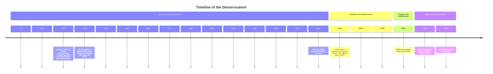

---
aliases:
  - Why Catholic Bibles Are Bigger
title: Why Catholic Bibles Are Bigger
author: Gary Michuta
category: Religion
publisher: Catholic Answers Press
total_page: 383
publish_date: 2017-09-15
isbn10: 1683570510
isbn13: 9781683570516
wishlist: 2022-12-13
acquired: 2023-12-13
started: 2023-12-17
finished: 2024-01-05
finishednotes: 2024-01-31
mermaid: true
---
# *[Why Catholic Bibles Are Bigger](https://shop.catholic.com/why-catholic-bibles-are-bigger-revised-2nd-edition/)* by [[Gary Michuta]]

`(New York: Catholic Answers Press, 2017), 383`

>The time has come when all real Protestants should demand the whole Bible.
>–Episcopal minister Rev. Milo H. Gates (1915 sermon)

>The scoffs thrown at the head of the little fish of Tobit will sooner or later destroy Jonah's whale.
>–Edward W. Reuss, *[[~History of the Canon of the Holy Scriptures in the Christian Church|History of the Canon of the Holy Scriptures in the Christian Church]]*

This books asks the question *Did the Council of Trend add books to Old Testament Scripture or did Protestantism remove them?* and answers clearly: Protestantism removed them. The book provides ample evidence and citations for the overall arc of the deuterocanon books, which is loosely as follows:
- There were various Jewish canons in the first century (and various Jewish sects). But only the Pharisees survived the first revolt, and Rabbi Akiva closed the Rabbinic Bible in the early second century.
- The earliest Christians accepted the deuterocanon as Scripture, including by virtually all of the Fathers until Jerome in the 4th century
- Jerome's innovation—Hebrew Verity—was the view that there was only one Hebrew text which was the inspired original, and therefore the books of the Septuigint that he did not have access to Hebrew originals for were not canonical (this was disproven by the Dead Sea / Qumran Scrolls) 
- Martin Luther cited the deuterocanon as Scripture until the Second Leipzig Disputation in 1519 when his opponent Eck cited 2 Maccabbees on the topic of Purgatory, after which rejected the deuterocanon as authoritative (though it was included as an appendix in his German translation of the Bible, as it was in virtually all early Protestant Bibles until the early 17th century)
- Puritan theology and the opportunity of cost savings resulted in the removal of the deuterocanon from most Protestant Bibles by the 1830s.
- English Puritanism, and American anti-Catholicism and misunderstanding, are two of the major contributors to the forgetting of the deuterocanon from the 1830s to the 1940s.
- The discovery of the Dead Sea Scrolls in the 1940s disproved Jerome's Hebrew Verity and led to some new Protestant translations that include the deuterocanon.
- The deuterocanon is slowly returning: as one anecdote, as of late 2023, 12 of the 57  Bibles published by Cambridge Bibles (or about 20%) include the Apocrypha, in addition to 4 stand-alone editions, and per their representative, "This number has gradually been increasing in recent years".

The near-universal ignorance of the deuterocanon among the average Protestant is a new phenomena when compared to the 2000 year history of Christianity as well as the 500 year history of Protestantism. 

We should agree with Rev. Milo H. Gates who said in a 1915 sermon that "the time has come when all real Protestants should demand the whole Bible," and heed the warning of Edward W. Reuss against disparaging the deuterocanon, since "the scoffs thrown at the head of the little fish of Tobit will sooner or later destroy Jonah's whale." I hope Bible publishers will continue to offer more high quality Bibles with the Apocrypha/Deuterocanon. The *[[~Cambridge ESV Diadem Reference Bible with Apocrypha Red Calfskin|Cambridge ESV Diadem with Apocrypha]]* is phenomenal! I would love to see a Cambridge Pitt Minion with Apocrypha, and a Schuyler Personal Size Quentel with Apocrypha! 

One question coming out of this book for me as a Catholic is this: *What posture should we take toward the additional books of the deuterocanon including 1-4 Esdras and 3-4 Maccabees?* I have read [[~The New Oxford Annotated Bible with Apocrypha#4 Maccabees|4 Maccabees]] and found it captivating, and plan to study these books more.

# Notes

 
<i>Contents</i>

<!-- MarkdownTOC autolink="true" -->

- [Preface](#preface)
- [Introduction](#introduction)
- [Chapter 1: Was the Old Testament Closed Before Christ?](#chapter-1-was-the-old-testament-closed-before-christ)
- [Chapter 2: The Deuterocanon and the New Testament](#chapter-2-the-deuterocanon-and-the-new-testament)
- [Chapter 3: The Closing of the Rabbinic Bible](#chapter-3-the-closing-of-the-rabbinic-bible)
- [Chapter 4: The Bible of the Earliest Christians](#chapter-4-the-bible-of-the-earliest-christians)
- [Chapter 5: When Contents Became Canon](#chapter-5-when-contents-became-canon)
- [Chapter 6: Crossing the "Apocrypha" Line](#chapter-6-crossing-the-apocrypha-line)
- [Chapter 7: The Age of Preservation](#chapter-7-the-age-of-preservation)
- [Chapter 8: "As Jerome Saith..."](#chapter-8-as-jerome-saith)
- [Chapter 9: Florence, Trent, and the Renaissance..](#chapter-9-florence-trent-and-the-renaissance)
- [Chapter 10: Why Protestant Bibles Are Smaller](#chapter-10-why-protestant-bibles-are-smaller)
- [Chapter 11: The Deuterocanon in Exile](#chapter-11-the-deuterocanon-in-exile)
- [Chapter 12: Answering the Ultimate Question](#chapter-12-answering-the-ultimate-question)
- [Appendix 1: Sola Scriptura and the Problem of the Canon](#appendix-1-sola-scriptura-and-the-problem-of-the-canon)
- [Appendix 2: The Deuterocanon and Biblical Inerrancy](#appendix-2-the-deuterocanon-and-biblical-inerrancy)
- [Appendix 3: Esdras, Carthage, and Trent](#appendix-3-esdras-carthage-and-trent)

<!-- /MarkdownTOC -->

## Preface 
- Question for the book: **_Did the Council of Trend add books to Old Testament Scripture or did Protestantism remove them?_** (7)
- "The issue of the deuterocanon is perhaps *the* most important subject for anyone who takes the word of God seriously." (9)
## Introduction
- "The question of which books belong to the Bible is more fundamental than theology because theology is to be based upon divine revelation." (14)
## Chapter 1: Was the Old Testament Closed Before Christ?
- Anti-Deuterocanon argument: *The Old Testament canon was closed before Christ and before the deuterocanon was written, so it cannot be Scripture* (17)
- Three untenable  arguments are given to support this:
	- 1) **No Prophets**: Scripture is prophetic, but 1 Maccabees denies prophets in that day, so Deuterocanon is not scripture 
		- "Prophet" in two senses: *public* prophets, and *post facto* prophets 
		- Ezra and Nehemiah two examples of non-prophets who wrote protocanonical books
	- 2) **Jesus' Bible**: Jesus' Bible is identical to the Rabbinic Bible, which does not include the Deuterocanon
		- First-century Judaism was comprised of several groups (there was no single canon)
	- 3) **Cessation of Prophecy**: Prophecy ceased after King Artaxerces (5th century BC), so Deuterocanon cannot be Scripture 
- The NT indirectly shows that prophets and prophecy were a common feature of the time (47)
## Chapter 2: The Deuterocanon and the New Testament
- The NT quotes the deuterocanon (including 10 references in the 1611 KJV), it does not quote a number of protcanonical books, and it quotes non-canonical writings. The presence of a quote is not sufficient, but the *way* it is quoted (50)
- Important references:
	- [[Mt-27#v43]] and [[Wis-02#v15]]-16
	- [[Jn-10#v22]] and [[1 Mc-04#v59]] ("Feast of Lights")
	- Extensive allusion to [[Sirach]] in [[James]] (65)
	- ...many others listed and evaluated 
- "The inspired authors of the new Testament referenced, used, and integrated the deuterocanon into their work just as they did the other Old Testament texts...The New Testament authors used the deuterocanon in a way indistinguishable from Sacred Scripture." (69)
## Chapter 3: The Closing of the Rabbinic Bible
- Various Jewish canons (71)
	- Sadducees and Samaritans: only the five books of Moses 
	- Essenes: not Esther, but Tobit, Sirach, Enoch, and others 
	- Shammai and Hillel Pharisees disagreed about Ecclesiastes, Song of Solomon, Esther 
- Only Christians and Pharisees survived the first revolt; Jamnia became the new center of Jewish religion (73)
- Jewish oral tradition was written under Akiva ben Joseph (75), using the *inclusion and exclusion* method giving the interpreter latitude to read vast amounts of legislation into the Hebrew text (76)
- Rabbi Akiva closed the canon of the rabbinic Bible, corresponding roughly to the Hebrew Masoretic Text. Akiva rejected the Gospels, Sirach, and all books written afterward, hence being a "hostile witness" to the fact that the earliest christians accepted both the Gospels and the deuterocanon as Sacred Scripture (79)
## Chapter 4: The Bible of the Earliest Christians
- He goes father-by-father and notes relevant citations they make...
- "The apostolic fathers freely use the deuterocanon much in the same way as they do the other books of Scripture, which mirrors what we found in the New Testament." (89)
- "As Ralph Brabban concludes after a thorough examination of the Apostolic Fathers, their 'canon' was not restricted to the contents of the rabbinic Bible, but it appears to be much larger, including the book of Wisdom, Sirach, Judith, Esther (expanded version), Tobit, 4 Esdras, (1) Enoch, and expanded Jeremiah, and perhaps others as well." (90, cf. *[[~The Use of the Apocrypha and Pseudepigrapha in the Writings of the Apostolic Fathers|The Use of the Apocrypha and Pseudepigrapha in the Writings of the Apostolic Fathers]]*)
- Conclusion: "The earliest extra-biblical Christian writings show a marked acceptance of the deuterocanon...Origen appealed to the universal use of these books as Scripture in the Church." (113)
- With the exception of Julius Africanus and a pair of qualified quotations from Origen, the fathers universally accepted the deuterocanon (117)
## Chapter 5: When Contents Became Canon
- [[St. Athanasius|Athanasius]] was the first to construct a comprehensive list of Sacred Scripture (117)
- Cyril of Jerusalem: "And whatever books are not read in churches, these read not even by you, as you have heard me say." (125)
	- →*Should our reading be somewhat proportional to the appearance in the lectionary?*
- Goes through some later fathers to show how they use the deuterocanon...
- None of the fathers up until the fourth century assigned the deuterocanon to the category of apocrypha (144)
## Chapter 6: Crossing the "Apocrypha" Line
- [[St. Jerome|Jerome]] sowed the seeds of confusion about the deuterocanon for centuries to come (145)
- Pope Damascus commissioned Jerome to produce a fresh Latin translation of Sacred Scripture (the Vulgate)
- **Hebrew Verity**: Placing the Hebrew Masoretic Text over all other versions: Jerome had many versions of the Greek [[Septuagint]], but what he thought was a single, stable Hebrew Bible, so why not translate directly from Hebrew.
- In principle Jerome was right, but he made an error in thinking that the MT was the single Hebrew original. This error was demonstrated by the discovery of the Dead Sea Scrolls which shows that parts of the Septuagint preserve remnants of a more ancient Hebrew original that is now lost. 
- Jerome was the first Western Father to deny the inspiration of the deuterocanon, which was an innovation (147)
- Jerome wrote prefaces to his translation circulating this innovative view, including "ragged patches of words" and "gold in the slime" (149)
- "Jerome's innovation tampered with the deposit of faith. The Church does not make Scripture. Instead, the bride of Christ passively receives the written word of God from Christ and his apostles as part of the original deposit of faith." (152)
- [[St. Augustine|Augustine]] recognized Church usage as the indicator of canonicity: "The canonical scriptures he will judge according to the following standard: to prefer those that are received by all the Catholic churches to those which some do to receive." (154 cf *[[~On Christian Teaching|On Christian Teaching]]*)
- The Church normally doesn't define a doctrine unless a truth of the Faith has been denied or undermined. It wasn't until Jerome rejected the deuterocanon and broadcasted his opinion that clarification was need at the councils of Hippo (393) and Carthage III (397)
- Pope Innocent I's canonical list mirrors the Councils of Rome, Hippo, Carthage and reaffirms the traditional canon (163)
- Jerome's innovative idea that the deuterocanon is apocryphal was met by a series of decrees that reaffirmed the historic Christian Old Testament (165)
## Chapter 7: The Age of Preservation
- Jerome's Vulgate became *the* version by the sixth century, lending credibility to his prefaces and views on the deuterocanon, causing some to adopt his views (167)
- The earliest complete Christian bibles are from the fourth and fifth centuries (chart on 168 showing which books are included). None are restricted to the shorter Hebrew canon; all include some, many, or all of the deuterocanon, which are intermixed with the other books (170)
- "Isidore is an excellent example of how a writer acknowledges the rabbinic canon whithout rejecting the deuterocanon." (179)
- Study Scripture like [[St. Bede]]: "From the time of my admission to the priesthood to my re present fifty-ninth year, I have endeavored for my own use and that of my brethren, to make brief notes upon the holy Scripture, either out of the works of the venerable Fathers or in conformity with their meaning and interpretation." (182, cf. *Ecclesistical History*, Book 5, 24)
- Alcuin was the first to try to reconcile Jerome's opinion with the rest of the Church (185)
- *Glossia Ordinaria of Sacram Scripturam* was a Bible with commentary from the Fathers arranged around the text (188)
## Chapter 8: "As Jerome Saith..."
- The Middle Ages saw a renewed study of Scripture which reinvigorated Jerome's writings. Everyone was aware of Jerome's opinions on the deuterocanon: most followed the Church, some tried to reconcile Jerome with the Church, and a few followed Jerome entirely (196, 213)
- [[St. Thomas Aquinas|Aquinas]] uses the deuterocanon authoritatively throughout (207)
- This chapter surveys what various scholars thought; the four who followed Jerome entirely are [[Hugh of Saint Victor]], [[John of Salisbury]], [[Nicholas of Lyra]], and [[William of Occam]]
## Chapter 9: Florence, Trent, and the Renaissance..
- Jerome's influence increased in the Renaissance, especially the 13th and 14th centuries 
- The [[Council of Florence]] (1439-1445) issued a decree that included a list of the books of Sacred Scripture, the first time any ecumenical council had raised the issue to this level of solemnity (216)
- On the importance of continuing to work for the unity of [[Vatican II]]: "The most important and authoritative councils of the Church took decades (even centuries) to bring about unity; the great [[Nicaea I|Council of Nicaea]] of 325, for instance, accepted by both Catholic and Protestant alike, was contradicted by important figures *within the Church* for decades afterward." (218)
- The [[Council of Trent]] decided early on to address Scripture and Sacred Tradition because both were prerequisites to all discussions of doctrine (229)
	- Trent "received the books simply and entirely as the Church had done in other councils, especially Florence, without further distinctions" (231)
	- "Did Trent *add* books to the Bible? The answer is decidedly no." (234)\
- [[Vatican I]] rejects the idea that they are *made* canonical by being declared such by the Church. The Catholic Church teaches that the canonical books are canonical because they were written by the inspiration of the Holy Spirit and, in God's providential care, were entrusted to the Church." (236)
## Chapter 10: Why Protestant Bibles Are Smaller
- "Before 1599, nearly all Protestant bibles included the deuterocanonical books; between the years 1526 and 1631, Protestant bibles with the deuterocanon were the rule and not the exception. It was not until the middle of the seventeenth century that the tide began to turn toward smaller bibles for Protestants. By 1831, the books of the deuterocanon, along with their cross-references, were almost entirely expunged from Protestant translations. This eradication has been so complete that few Protestants today are aware that such editions of Scripture ever existed. This process of eradicating the deuterocanon began with Martin Luther." (237)
- [[Martin Luther]]: 
	- Published his 95 theses in 1517, and cited the deuterocanon as Scripture in three publications in 1518 (237+)
	- At the Second Leipzig Disputation in 1519 on the subject of purgatory Eck appealed to [[2 Mc-12#v45]]. Luther refused to allow 2 Maccabees to be entered into argument because it does not belong to the canon. This led to his [[Canon Within a Canon]] approach where the canon is a spectrum of authority depending on each books *apostolicity* (243-245)
	- Luther's Bible (1534) ordered the OT chronologically and put the deuterocanon in an appendix called *Apocrypha* at the end of the OT (247)
		- "Apocrypha—that is, books which are not held equal to the holy scriptures and yet are profitable and good to read." (247, from Luther's title page)
- The Zurich Bible (1531) had an appendix of *Apocryphi*. [[Zwingli]] states in the preface that the Apocrypha are included "so that no one may complain of lacking anything, and each may find what is to his taste." (250...how like [[Jgs-21#v25]]!!)
- [[John Calvin]] in preface to the 1540 edition of the Geneva Bible: "the Apocrypha is not to be despised, insofar as it contains good and useful teaching...but these writings cannot provide full assurance of their faith" (251-252), but then proceeds to provide in *Antidote to the Council of Trent* (253) a view that Jerome was the consensus, and in *Institutes* (256) to again appeal to Jerome, or say "I will not deign to reply"
- Today, scholars know that all of the deuterocanon—with the exception of Wisdom and 2 Maccabees—was originally composed in Hebrew (253)
- Early English Bibles after the English Reformation typically had the deuterocanon in an appendix, including the Myles Coverdale Bible (1535), the Matthew Bible (1537), the Taverner's Bible (1539), the Great Bible (1539); Anglican bibles often "reflect something approaching a real acceptance of the deuterocanon as Scripture" (266)
- "This contradiction within the *[[Thirty-Nine Articles of Religion]]* illustrates the theological tension that was present in much early Protestant theology with regard to the canon. Doctrinally, the deuterocanon could not be admitted to the same authority as the protocanon, yet a vast majority of the early Protestants, including the Reformers, would not dare remove these books because the simplest peasants knew they were part of the Bible. Therefore, early Protestantism propagated the deuterocanon while at the same time denying its authority." (270)
- English Puritans worked to fully remove the deuterocanon so as to purify the English church by removing and remaining popish teaching. This led to the removal of the deuterocanon from the 1599 Geneva Bible (272)
- The 1611 King James Version included the deuterocanon as an appendix between the OT and NT (273). Cross references from the text to the deuterocanon, including 11 in the NT, were retained for some time even after the appendix of the deuterocanon itself was removed (274)

## Chapter 11: The Deuterocanon in Exile
- Puritan theology and considerations of economics by Bible societies combined in the early 1800's to exclude the deuterocanon entirely.
- The first Bible Society in Germany included the deuterocanon in its bibles (277)
- The British and Foreign Bible Society was formed in 1804, decided in 1813 to not prohibit funding Bibles with the deuterocanon, in 1822 stopped funding the deuterocanon portion of a Bible if it was included in a printing (278), and in 1827 prohibited funding of any Bible with the deuterocanon after pressure from the Edinburgh Bible Society (286)
- The Edinburgh Bible Society advocated for the complete removal of the deuterocanon books and all references to them because they "endanger the souls of men and insult the honor of God", and "there was danger of the Protestant confounding the apocryphal with the canonical books and of their being thus led to adopt some of the errors of Popery (particularly that of purgatory)" (282, cf. the Edinburgh Bible Society *Second Statement*, despite warnings in [[Dt-12#v32]], [[Prv-30#v5]]-6, [[Rv-22#v18]]-19)
- American Protestantism is deeply rooted in English Puritanism, so bibles with the Apocrypha were not part of the Protestant American heritage (Lutherans and Catholics are the only sizable groups in America who use the deuterocanon) (288)
	- Protestants often misunderstood Catholic rejection of bibles (without the deuterocanon) as blanket rejection of the Bible (289)
- The discovery of the Dead Sea Scrolls in the 1940s renewed interest in intertestamental studies, and it spawned several new Protestant translations with the deuterocanon (291)
- 1915 sermon by Episcopal minister Rev. Milo H. Gates (290):

>**The time has come when all real Protestants should demand** from the Bible societies **the whole Bible**. The day was, and it was not long ago, when every true Protestant had as the motto on his banner, "The Bible and the Bible only; our rule of faith and practice." Therefore the true Protestants should now make a fight for the restoration of the Bible. One of the greatest libraries of sacred writings is contained in what is known as the [[Deuterocanonical Books|Apocrypha]]... It is the fault of Bible societies that this wonderful part of holy writ has been stolen from the Bible. If these Bible societies were truly Protestant they would not commit such a grievous theft. They would not keep the Bible from the common people. What we need today is either a reform or the retirement of the so-called Bible societies. If they are permitted to go on, I fear that they will continue more seriously to hinder the use of the holy scriptures. What we need is a new Luther to arouse us and to lead a new Reformation for the freedom of the Bible. He will find its most powerful enemy not at Rome, but in the "Bible Houses" of the United States and England.
>–Episcopal minister Rev. Milo H. Gates (1915 sermon)

## Chapter 12: Answering the Ultimate Question
- *Inspiration* is what defines Scripture (293 cf. [[2 Tm-03#v16]])
- Early Christians believed that the deuterocanonical books were inspired. 
- Apart from Julius Africanus's dispute with Origen, it wasn't until Jerome at the end of the fourth century that anyone denied the inspiration of the deuterocanon.
	- Jerome's view that there was only one Hebrew text which was the inspired original (Hebrew Verity) was disproven by the Dead Sea / Qumran Scrolls
- The Councils of Hippo (393) and Carthage (397) affirmed the canon 
- Luther reversed his position on the inspiration of the deuterocanon for doctrinal reasons (purgatory in 2 Maccabees)

## Appendix 1: Sola Scriptura and the Problem of the Canon
- *[[sola scriptura]]* effectively destroys any logically consistent explanation of how we come to the knowledge of which books make up Scripture to begin with (303)
- **Historical-Investigative Approach**: canon determined by [[historical-critical method]], which sets the results of external historical investigation as the norm above the norm of Scripture 
- **Canon-Within -a-Canon Approach**: the canonical scriptures demonstrated their own canonicity by their contents, but this relies on circular reasoning, fails to provide the level of certitude necessary to establish the limits to the word of God, and sets up an extra-Biblical standard (i.e. Luther's own understanding)
- **The Self-Attesting/Inner Witness Approach**: canonicity is determined by the quality of the writing itself, but this does not explain variances of canons and can never provided a closed or fixed canon
- "*Sola scriptura* is a self-refuting proposition. No one can know, with sufficient certainty, what the Scripture is unless he adopts a norm outside o fScripture that sets the limits of Scripture...The only alternative to these *a posteriori* solutions is treat the canon as something handed down or received." (309)
## Appendix 2: The Deuterocanon and Biblical Inerrancy
- Inerrancy is the product of inspiration, and the determination of inspiration must come before the other questions are asked. 
- Appealing to errors in the deuterocanon is *begging the question* because it begins with the presupposition that the deuterocanon is *not* inspired. 
- This method can be used against the rest of the Bible as well: " The [[Deuterocanonical Books|Apocrypha]] were hated because the Catholics were hated...The scoffs thrown at the head of the little fish of Tobit will sooner or later destroy Jonah's whale." (314, cf. Edward W. Reuss, *[[~History of the Canon of the Holy Scriptures in the Christian Church|History of the Canon of the Holy Scriptures in the Christian Church]]*, trans. David Hunter (Edinburgh: R.W. Hunter, 1891), 361)
- "It takes humility to accept the canon of Scripture as given to the Church." (315)
## Appendix 3: Esdras, Carthage, and Trent
- Did Trent reject a book that Carthage and Hippo accepted (Esdras)?
- [[St. Augustine|Augustine]] accepted the book of Esdras as inspired Scripture since he quotes it as such in *[[2017-01-03-The City of God|City of God]]* 18, 36
- But the book of Esdras is composed entirely of canonical material ([[2 Chr-35]]-36, [[Ezra]] except [[Ez-04#v6]], and [[Neh-07#v72]]-8:14a) and is therefore "rewritten Scripture"
- Church Fathers quoted it since they viewed it as another translation of Ezra-Nehemiah
- Trent did not explicitly reject Esdras, 3 Ezra, and 3 Maccabees (books in the Latin Vulgate but not in the official canon), but passed over the question in silence 

--- 
**Topic**: [[Bible Translations]], [[Deuterocanonical Books]]

**Source**
- [Article: Why Protestants Reject 7 Books of the Bible](https://catholicconvert.com/why-protestants-reject-7-books-of-the-bible-the-short-answer/)

**Bibliography**
- *[[~The Case for the Deuterocanon|The Case for the Deuterocanon]]*
- *[[~15 Myths Mistakes and Misrepresentations about the Deuterocanon|15 Myths Mistakes and Misrepresentations about the Deuterocanon]]*
- many others in the notes...

**New Words**
- **Recension**: A critical revision of a text incorporating the most plausible elements found in varying sources (217)

---
Created: [[2022-12-13-Tue]]
Updated: `=dateformat(this.file.mtime, "yyyy-MM-dd-ccc")`
