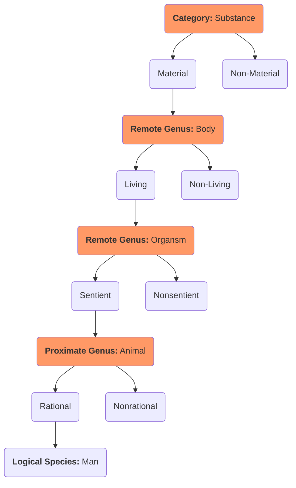

---
aliases:
  - Traditional Logic I
title: Traditional Logic I
author: Martin Cothran
category: Mathematics
publisher: Memoria Press
total_page: 150
publish_date: 2000-01-01
isbn10: 1930953100
isbn13: 9781930953109
source: 
wishlist: 2024-07-06
acquired: 2024-07-02
started: 2024-07-14
finished: 
finishednotes:
latex: true
mermaid: true
---
# *[Traditional Logic I](https://www.memoriapress.com/curriculum/logic-and-rhetoric/traditional-logic-i-complete-set-with-online-instruction/)* by [[Martin Cothran]]

`(Louisville: Memoria Press, 2000), 150`

# Notes

 
<i>Contents</i>

<!-- MarkdownTOC autolink="true" -->

- [Introduction: What is Logic?](#introduction-what-is-logic)
- [Simple Apprehension \(Term\)](#simple-apprehension-term)
- [Chapter 1: What Is Simple Apprehension?](#chapter-1-what-is-simple-apprehension)
- [Chapter 2: Comprehension and Extension](#chapter-2-comprehension-and-extension)
- [Chapter 3: Signification and Supposition](#chapter-3-signification-and-supposition)
- [Judgment \(Proposition\)](#judgment-proposition)
- [Chapter 4: What is Judgment?](#chapter-4-what-is-judgment)
- [Chapter 5: The Four Statements of Logic](#chapter-5-the-four-statements-of-logic)
- [Chapter 6: Contradictory and Contrary Statements](#chapter-6-contradictory-and-contrary-statements)
- [Chapter 7: Subcontraries and Subalterns](#chapter-7-subcontraries-and-subalterns)
- [Chapter 8: Distribution of Terms](#chapter-8-distribution-of-terms)
- [Chapter 9: Obversion, Conversion, and Contraposition](#chapter-9-obversion-conversion-and-contraposition)
- [Deductive Inference \(Syllogism\)](#deductive-inference-syllogism)
- [Chapter 10: What Is Deductive Inference?](#chapter-10-what-is-deductive-inference)
- [Chapter 11: Terminological Rules for Categorical Syllogisms](#chapter-11-terminological-rules-for-categorical-syllogisms)
- [Chapter 12: Quantitative Rules for Categorical Syllogisms](#chapter-12-quantitative-rules-for-categorical-syllogisms)
- [Chapter 13: Qualitative Rules for Categorical Syllogisms](#chapter-13-qualitative-rules-for-categorical-syllogisms)
- [Chapter 14: Review](#chapter-14-review)

<!-- /MarkdownTOC -->

## Introduction: What is Logic?

**Definitions**
- Josiah Royce: "The science of order." 
- Raymond McCall: "Logic in general is the science of right thinking."
- [[Jacques Maritain]]: "Logic is the art which enables us to proceed with order, ease, and correctness in the act of reason itself." 
- Irving Copi: "The distinction between correct and incorrect reasoning is the central problem with which logic deals." 

**History of Logic**
- [[Aristotle]] (384-322 BC) is the "father of logic"
- Chrysippus (279-206 BC) laid the foundation for symbolic logic, which was picked up by Leibniz (1646-1716)
- [[John Stuart Mill]] (1806-1873) pioneered *induction*

**Two Branches of Logic**
- **Formal (*minor*) Logic***: concerned with the *form* or structure of reasoning, or the method of deriving one truth from another 
- **Material (*major*) Logic**: concerned with the *content* of argumentation and the *truth* of the terms

> You can only find truth with logic if you have already found truth without it.
> –[[G.K. Chesterton]]

**Truth, Validity, Soundness**
- A statement is either _**true**_ or _**false**_. A true statement corresponds to reality. 
- The structure of an argument is _**valid**_ if its conclusion follows logically from its premises, otherwise it is _**invalid**_.
- An argument as a whole is **_sound_** if all premises are true and the argument is valid.

**Components of an Argument**
- **Term**: the verbal expression of the mental act of **_simple apprehension_**
- **Proposition**: the verbal expression of the mental act of **_judgment_**, whereby we **affirm** that something *is* something, or **deny** that something *is not* something
- **Syllogism**: the verbal expression of the mental act of **_deductive inference_**, whereby we make the logical connections between the terms in the argument in a way that shows us that the conclusion either follows or does not follow from the premises 

| Mental Act          | Verbal Expression |
| ------------------- | ----------------- |
| Simple Apprehension | Term              |
| Judgment            | Proposition       |
| Deductive Inference | Syllogism.        |

# Simple Apprehension (Term)
## Chapter 1: What Is Simple Apprehension?
- **Sense Perception**: the act whereby your senses present an object to your mind; you perceive an object by means of your senses 
- **Mental Image**: the image of an object formed in the mind as a result of a sense perception of that object 
- **Simple Apprehension**: is an act by which the mind grasps the general concept of an object without affirming or denying anything about it.
- **Abstraction**: is the process by which a simple apprehension is derived from a sense perception and mental image.

## Chapter 2: Comprehension and Extension
- The two properties of simple apprehension (concepts) are **_comprehension_** and **_extension_**
- **Comprehension** is the completely articulated sum of the intelligible aspects or elements (or notes) represented by a concept.
	- A comprehension answers the question, *"What is a `<blank>`?"*
	- A **Note** is the simple (atomic) concept that cannot be broken into simpler parts 
	- The **Porphyrian Tree** (invented by third-century logician Porphyry) allows us to identify the notes associated with a concept

- **Extension** tells us to which things an essence applies.
	- An extensions answers the question, *"To what does the concept `<blank>` refer?*
- The greater number of notes a concept has, the less extension it has (something more specific is less applicable). 

## Chapter 3: Signification and Supposition
- A **Term** is the verbal expression of a concept.
- The two properties of terms are **_signification_** and **_supposition_**.
- **Signification** is a way of dividing terms:
	- **Univocal terms** are terms that have exactly the same meaning no matter when or how they are used. 
	- **Equivocal terms** have different and unrelated meanings.
	- **Analogous terms** are applied to different things but have related meanings. 
	- *→Logic requires an accurate and consistent use of terms (which is an issue with equivocal and analogous terms).*
- **Supposition** is a way of dividing terms:
	- **Material supposition** is when a term refers to something as it exists *verbally*
	- **Logical supposition** is when a term refers to something as it exists *logically* or *mentally*
	- **Real supposition** is when a term refers to something as it exists in the real world

# Judgment (Proposition)
## Chapter 4: What is Judgment?
- **Judgment** is the act by which the intellect unites the *subject* and *predicate* by affirming, or separates them by denying. 
	- **Judgment** is a mental act whose verbal expression is a **proposition**.
- A **Proposition** is a statement which expresses truth or falsity. A proposition consists of three elements: the **subject-term** (**S**), the **predicate-term** (**P**), and the **copula** (**c**, usually "is" or "are"), which must be arranged in **logical form**. 
	- $\text{\langle Man\rangle}^S \text{ \langle is\rangle}^c \text{ \langle an animal}\rangle^P$
	- "The little brown-haired boy screams very loudly" becomes: $\text{\langle The little brown-haired boy\rangle}^S \text{ \langle is\rangle}^c \text{ \langle a child who screams very loudly}\rangle^P$

## Chapter 5: The Four Statements of Logic
- The **Four Statements of Logic**
	- **A**: All S is P (*affirmo*)
	- **I**: Some S is P
	- **E**: No S is P (*nego*)
	- **O**: Some S is not P
- **Quantifiers** include: all, some, no, some...not 
- The **Quality** of a proposition is **affirmative** or **negative**
- The **Quantity** of a proposition has to do with whether it is **universal** or **particular** (or **singular**, treated as universal). Statements are assumed to be universal unless stated otherwise.
	- **A**: Affirmative-Universal
	- **I**: Affirmative-Particular
	- **E**: Negative-Universal
	- **O**: Negative-Particular

| ↓Quantity/Quality→ | Affirmative     | Negative          |
| ------------------ | --------------- | ----------------- |
| **Universal**      | A (All S is P)  | E (No S is P)     |
| **Particular**     | I (Some S is P) | (Some S is not P) |

## Chapter 6: Contradictory and Contrary Statements 
- Categorical statements can be related in **Opposition** or in **Equivalence**
- **Opposition**: statements in opposition *affirm* and *deny* the same predicate of the same subject 
	- Contradictory 
	- Contrary 
	- Subcontrary 
	- Subaltern 
- **Equivalence**
	- Obversion 
	- Conversion 
	- Contraposition 
- **Rule of Contradiction**: Contradictory statements are statements that differ in both quality and quantity. Same colors (opposites) are contradictory:

| ↓Quantity/Quality→ | Affirmative                                    | Negative                                          |
| ------------------ | ---------------------------------------------- | ------------------------------------------------- |
| **Universal**      | <i style="color: #BD483E; ">A (All S is P)</i> | <i style="color: #46348B;">E (No S is P)</i>      |
| **Particular**     | <i style="color: #46348B;">I (Some S is P)</i> | <i style="color: #BD483E; ">(Some S is not P)</i> |

 - **The Rule of Contraries**: Two statements are contrary to one another if they are both universals but differ in quality. <i style="color: #BD483E; ">A (red)</i> and <i style="color: #46348B; ">E (purple)</i> are contrary:

| ↓Quantity/Quality→ | Affirmative                                    | Negative                                          |
| ------------------ | ---------------------------------------------- | ------------------------------------------------- |
| **Universal**      | <i style="color: #BD483E; ">A (All S is P)</i> | <i style="color: #46348B;">E (No S is P)</i>      |
| **Particular**     | I (Some S is P) | (Some S is not P) |

 - **First Law of Opposition**: Contradictories cannot at the same time be true nor at the same time be false.
 - **The Second Law of Opposition**: Contraries cannot at the same time both be true, but can at the same time both be false.

## Chapter 7: Subcontraries and Subalterns
_**Summary**: _

## Chapter 8: Distribution of Terms
_**Summary**: _

## Chapter 9: Obversion, Conversion, and Contraposition
_**Summary**: _

# Deductive Inference (Syllogism)
## Chapter 10: What Is Deductive Inference?
_**Summary**: _

## Chapter 11: Terminological Rules for Categorical Syllogisms
_**Summary**: _

## Chapter 12: Quantitative Rules for Categorical Syllogisms
_**Summary**: _

## Chapter 13: Qualitative Rules for Categorical Syllogisms 
_**Summary**: _

## Chapter 14: Review
_**Summary**: _

--- 
**Topic**: [[Logic]]

**Source**
- [[St. Thomas Aquinas|Aquinas]]

---
Created: [[2024-07-06-Sat]]
Updated: `=dateformat(this.file.mtime, "yyyy-MM-dd-ccc")`