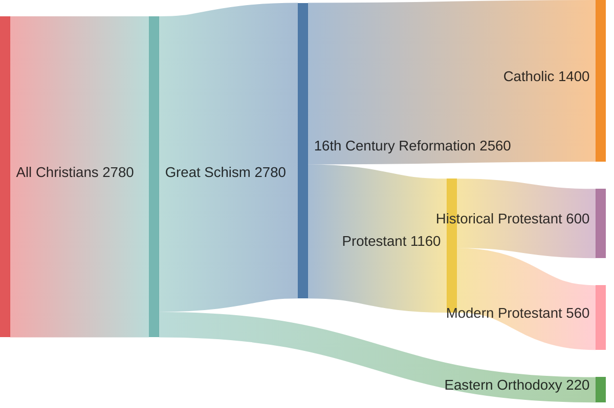

---
aliases:
  - The Reformation as Renewal
title: The Reformation as Renewal
author: Matthew Barrett
category: Religion
publisher: Zondervan Academic
total_page: 1009
publish_date: 2023-06-06
isbn10: 310097568
isbn13: 9780310097563
source: 
wishlist: 2025-05-30
acquired: 2025-06-15
started: 2025-07-29
finished: 
finishednotes: 2025-08-10
mermaid: true
---
# *[The Reformation as Renewal](https://zondervanacademic.com/products/the-reformation-as-renewal)* by [[Matthew Barrett]]

`(New York: Zondervan Academic, 2023), 1009`

>With verve and erudition, writing from the perspective of the vibrant movement of Reformed catholicity, Matthew Barrett has written a stimulating introduction to the figures and controversies of Reformation era. He defends the Augustinian-Thomistic theology that was advocated by a number of first- and second-generation Reformers. Historically sensitive and theologically sophisticated, Barrett's argument is that the Reformers carried forward a church that was catholic but not Roman. So long as it doesn't entail the notion Roman Catholics are Roman but not catholic, his argument may offer promising ecumenical potential.  
-Matthew Levering, *James N. Jr. and Mary D. Perry Chair of Theology, Mundelein Seminary*

---

I was excited to discover Matthew Barrett's work in *[[2025-05-31-Scrolling Ourselves to Death|Scrolling Ourselves to Death]]*: that book left me with questions about how Protestants view *tradition*, and Barrett seemed to be a Protestant who takes tradition seriously. 

This present work by Barrett does indeed take tradition quite seriously, and is "a fresh intellectual and theological history of the Reformation" which takes as a starting point that "the Reformers did not think the Reformation was primarily a revolution for new, modern ideas, but a retrieval and renewal of the one, holy, catholic, and apostolic church" (3). This is the key observation and conviction driving Barrett's project, namely that the intent of the Reformers (mainly Luther and Calvin) was to *restore* the church, rather than *found* a church. 

Jesus clearly expressed his desire for the unity of his church as recorded in [[Jn-17|John 17]]. Obedience to this wish compels all Christians to strive for greater unity and to make visible the points of unity we already share.

How might a Catholic promote unity? By praying for the reunion of all Christians in a [morning offering](https://www.usccb.org/prayers/morning-offering), reading books like *The Reformation as Renewal* to seriously study the views and arguments of serious Protestants, and cultivating relationships with individual Protestants so that our unity is personal and not merely intellectual. 

And how might a Protestant promote unity? In addition to the above, given the size[^size] of the Catholic Church (both in numbers today and in the weight of history) and the claims it makes about itself,[^claims] I think a Protestant might rightly ask questions such as *"What keeps me from communion with Rome?"* and *"How might I maintain both my tradition and communion with Rome?"* in working toward unity. 

[^size]: The Latin Church and the churches in communion with it comprise approximately 1.4 billion of the 2.7 billion Christians in the world ([source](https://en.wikipedia.org/wiki/List_of_Christian_denominations_by_number_of_members)).
[^claims]: See especially the *[Catechism of the Catholic Church](https://www.vatican.va/archive/ENG0015/__P29.HTM)* paragraphs 811-870

One recent demonstration of catholic unity that comes to mind is the [funeral mass for Pope Francis](https://youtu.be/tPWGIrD_K2U). Sure there were lots of Latin cardinals and lots of Italians, but also on display was the beautiful *unity* and *diversity* of the church with bishops from the many non-Latin churches in communion with Rome as well as believers from all over the world. The [Anglican Ordinariate](https://www.acsociety.org/map) is another example of living a Protestant tradition and liturgy in communion with Rome. 

With [Mickey Mattox](https://thelondonlyceum.com/on-matthew-barretts-the-reformation-as-renewal-retrieving-the-one-holy-catholic-and-apostolic-church/)I agree that "_The Reformation as Renewal_ reveals some surprising and often unrecognized ways in which we are already one". I hope to continue to search for and cultivate these ways in which we are united that we may live in accord with Jesus' prayer that we "may become perfectly one".[^jn1723]

[^jn1723]: "I do not pray for these only, but also for those who believe in me through their word, that they may all be one; even as thou, Father, art in me, and I in thee, that they also may be in us, so that the world may believe that thou hast sent me. The glory which thou hast given me I have given to them, that they may be one even as we are one, I in them and thou in me, that they may become perfectly one, so that the world may know that thou hast sent me and hast loved them even as thou hast loved me." (John 17:20-23, ESV)

---

# Notes

 
<i>Contents</i>

<!-- MarkdownTOC autolink="true" -->

- [Foreword](#foreword)
- [Chapter 1: The Catholicity of the Reformation](#chapter-1-the-catholicity-of-the-reformation)
	- [Who Is Catholic?](#who-is-catholic)
	- [Roman but Catholic?](#roman-but-catholic)
	- [Interpretations of the Reformation](#interpretations-of-the-reformation)
	- [The Paradox: Catholic Substance, Protestant Principle](#the-paradox-catholic-substance-protestant-principle)
- [Part 1: The Reformation's Catholic Context](#part-1-the-reformations-catholic-context)
- [Chapter 2: Spiritual Ascent and Mystical Dissent: *The Reformation and Monasticism*](#chapter-2-spiritual-ascent-and-mystical-dissent-the-reformation-and-monasticism)
- [Chapter 3: Faith Seeking Understanding: *The Advent of Scholasticism*](#chapter-3-faith-seeking-understanding-the-advent-of-scholasticism)
- [Chapter 4: Thomas Aquinas as a "Sounder Scholastic": *The Reformation's Critical Retrieval of Scholasticism*](#chapter-4-thomas-aquinas-as-a-sounder-scholastic-the-reformations-critical-retrieval-of-scholasticism)
- [Chapter 5: Provocation for Reformation: *The Via Moderna, Nominalism, and the Late Medieval Departure from the realism of Thomistic Augustinianism and Its Soteriology*](#chapter-5-provocation-for-reformation-the-via-moderna-nominalism-and-the-late-medieval-departure-from-the-realism-of-thomistic-augustinianism-and-its-soteriology)
- [Chapter 6: From Rebirth to Aberration: *The Reformation and Renaissance Humanism*](#chapter-6-from-rebirth-to-aberration-the-reformation-and-renaissance-humanism)
- [Chapter 7: The Ecclesiastical Watershed: *Conciliarism, Curialism, and the Papacy on the Eve of the Reformation*](#chapter-7-the-ecclesiastical-watershed-conciliarism-curialism-and-the-papacy-on-the-eve-of-the-reformation)
- [Part 2: The Genesis of Reformation](#part-2-the-genesis-of-reformation)
- [Chapter 8: Martin Luther as a Late Medieval Man: *Luther's Augustinianism, the Via Moderna, and the Papacy*](#chapter-8-martin-luther-as-a-late-medieval-man-luthers-augustinianism-the-via-moderna-and-the-papacy)
- [Chapter 9: Reforming the Reformation: *Liturgical Catholicity and the Prospects for Renewal*](#chapter-9-reforming-the-reformation-liturgical-catholicity-and-the-prospects-for-renewal)
- [Chapter 10: From Union to Schism: *The Eucharist, the Turks, and the League*](#chapter-10-from-union-to-schism-the-eucharist-the-turks-and-the-league)
- [Chapter 11: Protagonists and Protestants: *Defining the Center of Reform*](#chapter-11-protagonists-and-protestants-defining-the-center-of-reform)
- [Part 3: The Formation of Reformed Catholicity](#part-3-the-formation-of-reformed-catholicity)
- [Chapter 12: The Renewal of a Catholic Heritage: *The Reformation among the Swiss*](#chapter-12-the-renewal-of-a-catholic-heritage-the-reformation-among-the-swiss)
- [Chapter 13: Abandoning Catholicity for Primitive Christianity: *Radicals and Revolutionaries*](#chapter-13-abandoning-catholicity-for-primitive-christianity-radicals-and-revolutionaries)
- [Chapter 14: Constructing a Reformed Church: *The Reformation in Strasbourg and Geneva*](#chapter-14-constructing-a-reformed-church-the-reformation-in-strasbourg-and-geneva)
- [Chapter 15: Fortifying a Reformed Church: *The Reformation in Geneva, Berne, and France*](#chapter-15-fortifying-a-reformed-church-the-reformation-in-geneva-berne-and-france)
- [Chapter 16: An Apology for the Universal Church: *The Reformation in England and Scotland*](#chapter-16-an-apology-for-the-universal-church-the-reformation-in-england-and-scotland)
- [Part 4: Counter-Renewal](#part-4-counter-renewal)
- [Chapter 17: Roman but Catholic? *Counter-Reformation, Catholic Renewal, and the Antidote*](#chapter-17-roman-but-catholic-counter-reformation-catholic-renewal-and-the-antidote)
- [Conclusion: The One, Holy, Catholic, and Apostolic Church](#conclusion-the-one-holy-catholic-and-apostolic-church)
- [Afterword](#afterword)
- [Resources](#resources)

<!-- /MarkdownTOC -->

## Foreword
*by [[Carl R. Trueman]]*

## Chapter 1: The Catholicity of the Reformation

### Who Is Catholic? 
- Thesis: _**"The Reformers believed that their teachings, in contrast to Rome's, were not only faithful to the sacred Scriptures but allegiant to the catholic tradition that embodied those same biblical teachings."**_ (2)
	- This book: "a fresh intellectual and theological history of the Reformation" which recognizes a historical truth: "the Reformers did not think the Reformation was primarily a revolution for new, modern ideas, but a retrieval and renewal of the one, holy, catholic, and apostolic church". (3)
	- "A *reformed catholic church*—that label (and goal) captures the title and subtitle of this project." (4)
- Calvin to Sadoleto: We are more catholic than you. "Our agreement with antiquity is far closer than yours." (2)
- T.H.L. Parker: "It was a belief common to the Reformers that they had on their side not only the Bible but also, on the major dogmas at issue, the Church fathers. It was not they who were the innovators; it was the Romanists." (3)

### Roman but Catholic? 
- Luther: "We are the true ancient church...you have fallen away from us." (5)
- Calvin viewed catholicity as a *theological* matter of sound doctrine (6)

### Interpretations of the Reformation 

**The Secularization Narrative** 
- **The Secularization Narrative**: "the Reformers were the perpetuators of the late medieval shift to voluntarism and nominalism, cutting the cord of participation between the Creator and the creature. However, the truth of history is far more complicated and nuanced." (19-20)
- "Hermeneutical pluralism has resulted in religious pluralism, as everyone claims to possess the only true interpretation of the text, and anyone can claim and exclusive legitimate application of Scripture to church and society. *[[Sola scriptura]]* is dangerous because it rebels against the authority of the church for the sake of the individual's rights. That, in turn, is a recipe for secularism, in which everyone becomes his own authority." (8)
- "The Reformers were far more complicated." (16)

**Modernism's Liberation or Radicalism's Opposition**
- "Liberalism appealed to the Reformation as if the Reformers were the first to set the Christian free from dogma." (20)
- "If modern liberalism points to the Reformation to celebrate the genesis of the enlightened individual who dispenses with tradition to stand on the autonomous stool of reason, evangelicals have sometimes embodied this same presupposition toward the Reformers but for the purpose of perpetuating a modern biblicism instead" (leading to the 'Oppositional Narrative') (22)
- "**Biblicism** moves beyond believing in the final authority of the Bible to imposing a restrictive hermeneutical method onto the Bible, identified by the following symptoms:" (21)
	- Ahistorical mindset: "No creed but the Bible" and "No authority but me"
	- Irresponsible proof texting: limiting itself to those beliefs explicitly laid down in Scripture and failing to deduce doctrines from Scripture by good and necessary consequence 
	- Anti-metaphysics: undervalues the use of philosophy 
	- Univocal predication: risks historicizing God by means of a literalistic interpretation of the text 
	- Overemphasis on the human author: struggles to explain the unity of the canon and Christological fulfillment
- The **Oppositional Narrative** views the Reformation as a *break* with the past. Four myths characterize the oppositional narrative: (22-23)
	- The Reformation was anti-tradition
	- The Reformation was not just anti-Catholic but also anti-catholic (universal church) as if the true church had been lost since the days of the apostles only to be recovered in the sixteenth century 
	- The Reformation was anti-medieval and anti-Scholastic 
	- The Reformation was anti-philosophy 
- The Oppositional Narrative is a prevalent default position among the evangelical masses (23)
- The Reformers were largely in agreement with Rome, with the exception of the two major areas of dispute: (24) 
	1. Soteriology (especially justification, the sacraments, and purgatory)
	2. Ecclesiology (especially papal authority over Scripture, the church, and society)
- "The Reformers affirmed tradition as a ministerial authority for the church, holding the church accountable to its creeds and councils, guiding the church in a sound, orthodox interpretation of Scripture." (25)
- David Steinmetz: "*[[Sola scriptura]]* generally meant *prima scriptura*, Scripture as the final source and norm by which all theological sources and arguments were to be judged, not Scripture as the sole source of theological wisdom." (25)
- Barrett's definition of *[[Sola scriptura]]* from *[[~God's Word Alone---The Authority of Scripture|God's Word Alone---The Authority of Scripture]]*: "only Scripture, because it is God's inspired Word, is the inerrant, sufficient, and final authority for the church." (26)

### The Paradox: Catholic Substance, Protestant Principle
- Jaroslav Pelikan articulates the paradox of Luther's ecclesiology: *Catholic substance* of tradition, liturgy and dogma embodied in the Roman Catholic Church, and *Protestant principle* being the criticism and reconstruction of this Catholic substance (29)
	- Luther expressed his protest "not as a revolutionary, nor even as a protesting critic, but primarily as a member of the church, as one of its doctors and professors" (29)
	- "Luther did not start a new church; the Pope forced a new church by removing one of its own members." (29)
- Steinmetz proposed three corrections: (30)
	1. The Reformation was pluralist (speak of "Reformations", not "the Reformation")
	2. The Reformation was "chronologically fluid", part of a long sixteenth century from 1400-1650 and not a break with the later Middle Ages
	3. The Reformation was "contextual": concerned with practical questions of salvation, church, and society 
- "Luther never stopped thinking of himself or the Reformation as part of the one, holy, catholic, and apostolic church." (31)
- "The Reformation should then be defined not according to its critics but on its own terms, as a movement of catholicity. What follows is *not* an attempt to mine the church fathers or medieval theologians to determine if the Reformers were right, which itself is a different project. Rather, what follows is a fresh, intellectual and theological history of the Reformation that listens to discern if the Reformers themselves interpreted their reform as a renewal of catholicity." (32)

# Part 1: The Reformation's Catholic Context

## Chapter 2: Spiritual Ascent and Mystical Dissent: *The Reformation and Monasticism*
_**Summary**: _

## Chapter 3: Faith Seeking Understanding: *The Advent of Scholasticism*
_**Summary**: _

## Chapter 4: Thomas Aquinas as a "Sounder Scholastic": *The Reformation's Critical Retrieval of Scholasticism*
_**Summary**: _

## Chapter 5: Provocation for Reformation: *The Via Moderna, Nominalism, and the Late Medieval Departure from the realism of Thomistic Augustinianism and Its Soteriology*
_**Summary**: _

## Chapter 6: From Rebirth to Aberration: *The Reformation and Renaissance Humanism*
_**Summary**: _

## Chapter 7: The Ecclesiastical Watershed: *Conciliarism, Curialism, and the Papacy on the Eve of the Reformation*
_**Summary**: _

# Part 2: The Genesis of Reformation
## Chapter 8: Martin Luther as a Late Medieval Man: *Luther's Augustinianism, the Via Moderna, and the Papacy*
_**Summary**: _

## Chapter 9: Reforming the Reformation: *Liturgical Catholicity and the Prospects for Renewal*
_**Summary**: _

## Chapter 10: From Union to Schism: *The Eucharist, the Turks, and the League*
_**Summary**: _

## Chapter 11: Protagonists and Protestants: *Defining the Center of Reform*
_**Summary**: _

# Part 3: The Formation of Reformed Catholicity
## Chapter 12: The Renewal of a Catholic Heritage: *The Reformation among the Swiss*
_**Summary**: _

## Chapter 13: Abandoning Catholicity for Primitive Christianity: *Radicals and Revolutionaries*
_**Summary**: _

## Chapter 14: Constructing a Reformed Church: *The Reformation in Strasbourg and Geneva*
_**Summary**: _

## Chapter 15: Fortifying a Reformed Church: *The Reformation in Geneva, Berne, and France*
_**Summary**: _

## Chapter 16: An Apology for the Universal Church: *The Reformation in England and Scotland*
_**Summary**: _

# Part 4: Counter-Renewal
## Chapter 17: Roman but Catholic? *Counter-Reformation, Catholic Renewal, and the Antidote*
_**Summary**: _

## Conclusion: The One, Holy, Catholic, and Apostolic Church
- Luther: "We are the true church, for have come from the ancient church and have remained in it...But you have fallen away from us and have become a new church opposed to us...We belong to the ancient church and are one with it, for whoever believes as the ancient church did and holds things in common with it belongs to the ancient church." (881-882)
	- "Luther was insistent that the papists were the 'new false church, which is in everything apostate, separated from the true, ancient church, thus becoming Satan's whore and synagogue'." (882 footnote 6) 
- "When Luther turned to his fifth proof for catholicity, he named the [[Apostles' Creed]] to locate the Reformation within the orthodoxy of its creedal tradition. The *sola scriptura* principle in no way stalled Luther's command, ordering the churches of the Reformation to believe, sing, and confess the creeds." (882)
	- → How is *[[sola scriptura]]* compatible with tradition, creeds, etc.? 
- "In Luther's own mind, his call for reform was not a summons to something modern. His vision for renewal was catholic. Debate may persist over the success of that vision, but no debate should exist over its self-professing identity." (883)
- "If Protestants today desire fidelity to the history of their own genesis, then they should listen to one of the Reformation's heirs, Abraham Kuyper: 'A church that is unwilling to be catholic is not a church, because Christ is the savior not of a nation, but of the world.... We cannot therefore, without being untrue to our own principle, abandon the honorable title of 'catholic' as though it were the special possession of the Roman Church.' What defines a true adherence to Protestantism? To be Protestant is to be catholic. But not Roman." (883)

## Afterword
*by Timothy George*
- "We know more, but do we perhaps see less?"
- Three myths about the Reformation: (885)
	- "The Reformation divided the church"
	- "Luther was the first modern man"
	- "The Reformation was a German event"
- "The context of the Reformation, largely understood, is the entire history of the people of God through the ages. Originality and innovation were not the agenda of the Reformers. They had no desire to leave the true catholic church, much less to start a new one. What the Reformers aimed for was the renewal of the one, holy, catholic, and apostolic church on the basis of the Word of God. What the Reformers thought they were doing was calling this church back to its true scriptural and evangelical origins—*ad fontes*!" (886)

---
*Here's my first draft response to this book:*

I was excited to discover Matthew Barrett's work in *[[2025-05-31-Scrolling Ourselves to Death|Scrolling Ourselves to Death]]*: that book left me with questions about how Protestants view *tradition*, and Barrett seemed to be a Protestant who takes tradition seriously. 

This present work by Barrett does indeed take tradition quite seriously, and is "a fresh intellectual and theological history of the Reformation" which takes as a starting point that "the Reformers did not think the Reformation was primarily a revolution for new, modern ideas, but a retrieval and renewal of the one, holy, catholic, and apostolic church" (3). This is the key observation and conviction driving Barrett's project, namely that the intent of the Reformers (mainly Luther and Calvin) was to *restore* the church, rather than *found* a church. Barrett specifically withholds any judgment on the Reformers, asserting that his project is "*not* an attempt to mine the church fathers or medieval theologians to determine if the Reformers were right, which itself is a different project" (32). 

I will admit that I have not finished reading Barrett's whole book yet, but from the first chapter and the conclusion the evidence is clear for his claim that the Reformers did not seek to innovate, at least with respect to the many quotes from Luther when he says as much himself.[^luther] But I am left wondering, what is the important question to answer? The question "*What did the Reformers claim?*" is an important start, and an understandable focal point if one is located in a reformed church that claims to carry forward the tradition of the ancient church. But this question is not sufficient to adjudicate the truth claims of the Reformers (or their modern heirs) against those of the Catholic Church.

[^luther]: The conclusion has a number of these quotes, including: ‣"We are the true church, for have come from the ancient church and have remained in it...But you have fallen away from us and have become a new church opposed to us...We belong to the ancient church and are one with it, for whoever believes as the ancient church did and holds things in common with it belongs to the ancient church." (881-882) ‣"Luther was insistent that the papists were the 'new false church, which is in everything apostate, separated from the true, ancient church, thus becoming Satan's whore and synagogue'." (882 footnote 6) 

Rather, I suggest that the two important questions to answer are: first the question Barrett excludes—perhaps to be addressed in another book?—*Are the Reformers right?*, and second, *Were the Reformers successful in their stated intention to restore the one, holy, catholic, and apostolic church?*

First, granted that the Reformers sought continuity with the ancient church, what we are interested in is whether they were right or not and whether we should believe what they did or believe what the Catholic church teaches.[^justification] The answer to this question is what should inform our own belief. 

[^justification] Barrett notes that the Reformers agreed with all the major doctrines of the Catholic Church with the exception of two major areas of dispute: Soteriology (especially justification, the sacraments, and purgatory) and Ecclesiology (especially papal authority over Scripture, the church, and society). Thankfully, the divide between the Reformers and the Catholic Church is less now than it was in the sixteenth century thanks to recent ecumenical work such as the *[[2025-08-07-Joint Declaration on the Doctrine of Justification|Joint Declaration on the Doctrine of Justification]]*.

Second, let's even supposed that on the matters of dispute the Reformers were correct and the Catholic Church is incorrect. I don't hold this view, but if it were true what would that mean for Christendom? 

The chart below illustrates the main divisions within Christendom today, with branches sized by the number of Christians in millions ([source](https://en.wikipedia.org/wiki/List_of_Christian_denominations_by_number_of_members)). 

"Historical Protestant" likely includes *more* than everyone who would agree with Barrett's claims: Anglican, Baptist, Lutheran, Calvinism/Reformed, Methodist, while "Modern Protestant" includes those I suspect would disagree with his claims: Pentecostalism, Non-denominational Christianity, and others. 

Let's oversimplify and say there are three views on tradition:
- In the first view, tradition doesn't really matter and the reformation was a break with the past. This is the "Oppositional Narrative" Barrett argues against, as manifest by both modern liberalism and biblicist evangelicalism (21-23).
- In the second view, the ancient tradition is preserved in the Catholic Church (and Eastern Orthodoxy, which maintains apostolic succession).
- In the third view, which is Barrett's, the ancient tradition is preserved in the reformed church(es).

This third view is where things get tricky. *Which* of the many reformed churches preserves this tradition, and which of the many reformers is correct when they disagree on matter important enough to cause schism? If this view is true, it means that some small fraction of the 600 million or so "Historical Protestants" preserve the ancient tradition, while the entire remaining 2+ billion Christians are in error.

Jesus clearly expresses his desire for the unity of his followers in [[Jn-17|John 17]]. Unless the doctrinal division is of such utmost importance, it seems as if obedience to this wish outweighs any other disagreements we may have on even important matters.t

With [Mickey Mattox](https://thelondonlyceum.com/on-matthew-barretts-the-reformation-as-renewal-retrieving-the-one-holy-catholic-and-apostolic-church/)I agree that "_The Reformation as Renewal_ reveals some surprising and often unrecognized ways in which we are already one". I hope to continue to search for and cultivate these ways in which we are united that we may live in accord with Jesus' prayer that we "may become perfectly one".[^jn1723]

---
##  Resources 
- [On Matthew Barrett’s “The Reformation as Renewal: Retrieving The One, Holy, Catholic, and Apostolic Church” - The London Lyceum](https://thelondonlyceum.com/on-matthew-barretts-the-reformation-as-renewal-retrieving-the-one-holy-catholic-and-apostolic-church/)
	- "With that hoped-for unity in mind, Barrett’s _The Reformation as Renewal_ reveals some surprising and often unrecognized ways in which we are already one. With that in mind we should be encouraged in our pursuit of the goal of visible unity in the _one_, holy, catholic, and apostolic Church. Who knows what the Spirit may give?"
- *[[~Rock and Sand|Rock and Sand]]*

--- 
**Topic**: [[Protestant Reformation]]

**Source**
- Wrote an essay cited in *[[2025-05-31-Scrolling Ourselves to Death|Scrolling Ourselves to Death]]*
 ---
Created: [[2025-05-30-Fri]]
Updated: `=dateformat(this.file.mtime, "yyyy-MM-dd-ccc")`