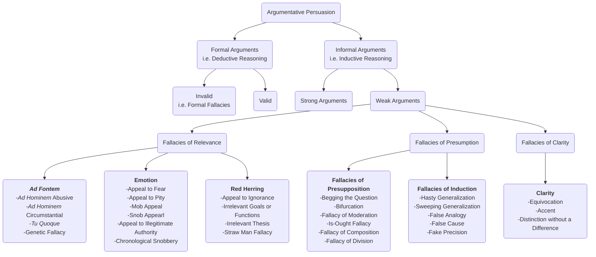

---
aliases:
  - The Art of Argument
title: The Art of Argument
author: Aaron Larsen, Chris Perrin
category: Fallacies (Logic)
publisher:
total_page: 0
publish_date: 2022
isbn10: 1600514502
isbn13: 9781600514500
source:
wishlist: 2025-09-24
acquired:
started: 2025-09-23
finished: 2025-09-30
finishednotes: 2025-09-30
mermaid: true
---
# *[The Art of Argument: An Introduction to the Informal Fallacies](https://classicalacademicpress.com/pages/series-art-of-argument)* by [[Aaron Larsen]], [[Chris Perrin]]

`(Camp Hill, PA: Classical Academic Press, 2022), 282`

## Fallacies of Relevance
*These arguments have premises that do not "bear upon" the truth of the conclusions. In other words, they introduce an irrelevancy into the argument.*
### *Ad Fontem* Arguments (Arguments against the source)
From the Latin *ad fontem*, meaning "to the source," these are a subgroup of the fallacies of relevance and they are arguments that distract by focusing attention on the source of the argument, rather than on the issue itself.

1. ***Ad Hominem* Abusive**: From the Latin phrase meaning "to the man," an *ad fontem* argument that attempts to avoid the issue by insulting an opponent with abusive language rather than focusing on the merits of the issue under consideration.

2. ***Ad Hominem* Circumstantial**: From the Latin phrase meaning "to the man," an *ad fontem* argument that tries to discredit an opponent (a person or an organization) because of his/its back-ground, affiliations, or self-interest in the matter at hand.

3. **Tu Quoque**: From the Latin phrase that means "you too," an *ad fontem* argument that assumes that a rival's recommendation should be discounted because the rival does not always follow it himself.

4. **Genetic Fallacy**: An *ad fontem* argument that states that an idea of belief should be discounted simply because of its source or origin.

###  Appeals to Emotion
A subgroup of the fallacies of relevance. These arguments attempt to sway the opinions of people by compelling them to feel emotions such as pity, anger, fear, joy, peer pressure, intimidation, etc.

5. **Appeal to Fear (*ad baculum*)**: An appeal to emotion that distracts by making the audience afraid of the consequences of disagreeing with the speaker. This fallacy seeks to arouse a fear of harm that is not realistic or related to the issue at hand.

6. **Appeal to Pity (*ad misericordiam*)**: An appeal to emotion that distracts by making the audience feel sorry for the speaker or someone on behalf of whom the speaker is arguing. This fallacy appeals to our sense of compassion.

7. **Mob Appeal (*ad populum*)**: An appeal to emotion that distracts by making the audience want to be part of the crowd or one of the "common people." To make up for a lack of solid evidence and sound reason, this argument appeals to the emotions of a crowd, the desire to be part of the majority, or the interests of the "common man."

8. **Snob Appeal**: An appeal to emotion that distracts by playing on a person's desire to feel "special." This is an emotional appeal to a sense of elitism or "discriminating taste."

9. **Appeal to Illegitimate Authority (*ad verecundiam*)**: An appeal to emotion that distracts the listener by citing an illegitimate authority and attempting to shame him into agreement. Includes appeal to the wrong or false expert, a biased expert, an unnamed expert, or a celebrity expert.

10. **Chronological Snobbery**: An appeal to emotion that distracts by making the audience want to either be part of an on old tradition, or part of the latest cool, new thing. In other words, this fallacy distracts by rejecting or accepting something merely on the basis of its age, making an appeal to tradition or to novelty.

### Red Herrings
A subgroup of the fallacies of relevance. These arguments introduce an irrelevancy that distracts from the issue at hand, but they do not "attack the source" or appeal to emotion.

11. **Appeal to Ignorance**: A red herring argument that claims that since a proposition cannot be disproven, it must therefore be true or likely.

12. **Irrelevant Goals or Functions**:  A red herring argument that distracts by measuring a plan or policy according co goals it wasn't intended to achieve.

13. **Irrelevant Thesis**: A red herring argument that distracts by introducing a related but different issue and making a case for the new issue, not the original one.

14. **Straw Man Fallacy**: A red herring argument that attempts to disprove an opponent's position by presenting it in an unfair, inaccurate light.

## Fallacies of Presumption
Arguments that make unwarranted assumptions about either the data or the nature of a reasonable argument.
### Fallacies of Presupposition
A subgroup of the fallacies of presumption. These arguments contain hidden assumptions that make them unreasonable.

15. **Begging the Question (*petitio principi*)**: An argument of presupposition that assumes the very thing that one is trying to prove.

16. **Bifurcation (*False Dilemma*)**: An argument of presupposition that frames the debate in such a way that only two options are possible, when, in fact, other possibilities may exist.

17. **Fallacy of Moderation**: An argument of presupposition that assumes the correct answer is always the middle ground or a compromise between two extremes.

18. **Is-Ought Fallacy**: An argument of presupposition that assumes that just because something is a certain way, it ought to be that way.

19. **Fallacy of Composition**: An argument of presupposition that assumes that the properties of the whole will be the same as the properties of the parts. In other words, this argument is saying that whatever the characteristics of the part are, the whole will have those same characteristics. It moves from part to whole in its reasoning.

20. **Fallacy of Division**: An argument of presupposition that assumes that the qualities of the whole will also be true of every part of that whole. It moves from whole to part in its reasoning.

###  Fallacies of Induction
A subgroup of the fallacies of presumption. Arguments that misuse empirical data or don't follow proper methods of inductive reasoning.

20. **Hasty Generalization (Converse Accident)**: A fallacy of induction that makes an unwarranted generalization on the basis of too few examples.

21. **Sweeping Generalization (Accident)**: A fallacy of induction that overextends a generalization to include facts or cases that are exceptions to it.

22. **False Analogy**: A fallacy of induction that is based on a weak analogy.

23. **False Cause**: A fallacy of induction that is based on a weak cause-and-effect connection.

24. **Fake Precision**: A fallacy of induction that uses numbers or statistics in a way that is too precise to be justified by the situation.

## Fallacies of Clarity
Arguments that fail because they contain words, phrases, or syntax that distort or cloud their meanings.

26. **Equivocation**: A fallacy of clarity in which a key term in the argument is employed more than once with several different meanings.

27. **Accent**: A fallacy of clarity that rests on an improper emphasis on certain words or phrases.

28. **Distinction without a Difference**: A fallacy of clarity that makes a linguistic distinction between two things that are actually not different from each other.

--- 
**Topic**: [[Logic]]

**Source**
- [[Aquinas Columbus]]
 ---
Created: [[2025-09-24-Wed]]
Updated: `=dateformat(this.file.mtime, "yyyy-MM-dd-ccc")`