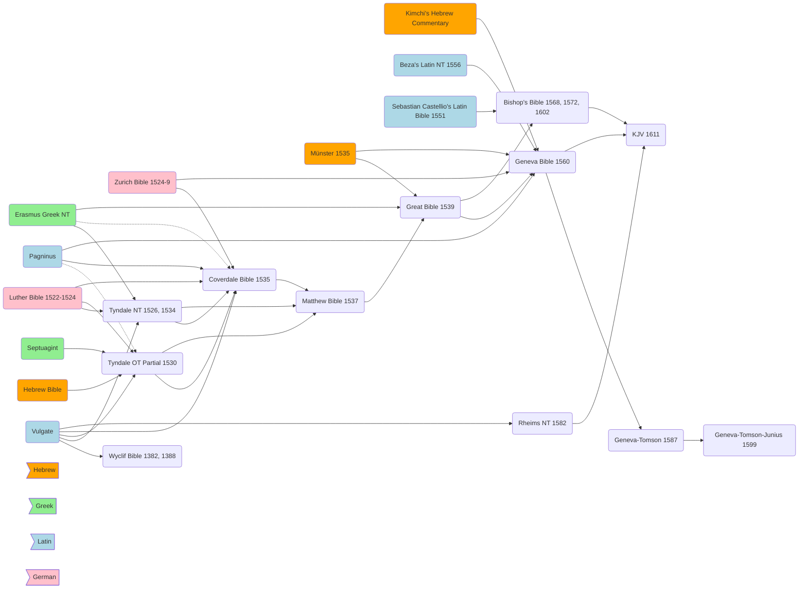

---
aliases:
  - The King James Bible
title: The King James Bible
author: David Norton
category: Bibles
publisher: Cambridge University Press
total_page: 231
publish_date: 2011-01-20
isbn10: 521851491
isbn13: 9780521851497
source: 
wishlist: 2025-04-29
acquired: 
started: 2025-06-03
finished: 
finishednotes:
---
# *[The King James Bible: A Short History from Tyndale to Today](https://www.cambridge.org/us/universitypress/subjects/religion/biblical-studies-new-testament/king-james-bible-short-history-tyndale-today)* by [[David Norton]]

`(Cambridge: Cambridge University Press, 2011), 231`

- currently reading the King James in *[[~The Pennyroyal Caxton Bible|The Pennyroyal Caxton Bible]]* and *[[~New Cambridge Paragraph Bible with Apocrypha|New Cambridge Paragraph Bible with Apocrypha]]*
- 

# Notes

 
<i>Contents</i>

<!-- MarkdownTOC autolink="true" -->

<!-- /MarkdownTOC -->

## Chapter 1: Predecessors
_**Summary**: Gives an outline of the texts from Tyndale to the KJV, including the translation sources. This is helpful for expanding the [[Bible Translation Chart]]._

#### Originals and Texts
- The KJV is "the most important book in English religion and culture." (1)
- The story of the KJV starts with the writing of the Hebrew Bible: "Reverence for the text and the problems of understaning it are essential background to the story of books, scholarship and men that becomes the story of the King James Bible." (2)
- The Old Testament is most of what survives of ancient Hebrew. It has a small vocabulary of 8,000 words: 1,000 occur only once, and 4/5 occur less than 20 times. (2)
- Ancient translations of the Hebrew include: Aramaic (sixth century BC), Septuagint (third century BC), Vulgate (404)
- There was little variation among Hebrew texts given their long tradition (3). But the Greek NT was later to be printed and slower to take a standard form, for example Erasmus "supplied his own Greek translation based on the Vulgate" in places: "Sometimes the results do not correspond to any Greek manuscripts, yet have remained in the Received Text." (4-5)
- Erasmus' text became known as the 'Textus Receptus', Received Text, and "there was a strong sense that the Greek text had attained a similar authenticity to that of the Hebrew." It remained the standard text into the nineteenth century. (5)
- The Textus Receptus has a special status and importance from majority attestation and traditional use, but modern textual criticism and knowledge of many more manuscripts now make it clear that this is not the closest we can get to the lost originals of the NT. (5)

#### The First Draft: William Tyndale
- The KJV translators thought of themselves as revisers of the Bishops' Bible of 1568 and Tyndale's translation, not as creators of a new translation. (7)
- "Without [[William Tyndale|Tyndale]], the English Bible would have been a different and, in all likelihood, lesser thing. Reading the KJB, we are for long stretches reading Tyndale, sometimes little revised, sometimes substantially worked over." (8)
- Tyndale "was the one who came closest to working from teh original languages alone." (8)
- Tyndale's first study was the original language text, and his primary effort was to be as true to it as possible, including keeping to its "phrase or manner of speech." (9)
- "The Bible in English shaped Protestant English-speaking culture. It was not just that the Bible was read, heart, and known: the Bible in English made the individualistic act of reading and understanding primary, creating a culture wedded to the belief that understood words were of the highest importance. Besides this, the Bible, more than any other writing in English, shaped the English language." (11)
- "The audience he had in mind did not know Latin. Latin was far less assimilated into English then than it is now. The common people would have heard much of what we take for granted as English as a foreign language only partly assimilated into their own, and they would have found Latin sentence structures very alien to their own way of talking. Any attempt to write with the eloquence of the classics would have sinned against both comprehensibility and the English languages just as much as literal translation would have." (12-13)

#### Revision, Completion of the First Draft, and More Revision: Myles Coverdale
- **1535 Coverdale Bible**: [[Myles Coverdale]] completed and revised the work begun by Tyndale, producing the first complete English printed Bible (OT, Apocrypha, and NT) in 1535. He relied on the Vulgate, Pagninus, Luther's Bible, and the 1524-9 Zurich Bible to translate 2/3 of the Bible in about a year. (14-15)
- Coverdale regarded translation as "no more than approximation to the meaning" and implies favor for a variety of translations, from his Prologue: 
	- "Sure I am that there cometh more knowledge and understanding of the Scripture by their sundry translations than by all the glosses of our sophistical doctors. For that one interpreteth something obscurely in one place, the same translateth another, or else he himself, more manifestly by a more plain vocable of the same meaning in another place. Be not thou offended therefore, good reader, though one call a scribe that another calleth a lawyer... For if thou be not deceived by men's traditions, thou shalt find no more diversity between these terms than between four pence and a groat. And this manner have I used in my translation, calling it in some place penance that in another place I call repentance, and that not only because the interpreters have done so before me, but that the adversaries of the truth may see how that we abhor not this word penance, as they untruly report of us." (15, against *[[2022-11-15-Liturgiam authenticam#^cddb13]]*)
- **1537 Matthew Bible**: John Rogers (pseudonym Thomas Matthew) revised Coverdale and reverted to Tyndale for the NT and Pentateuch. 
#### The First 'Authorized' Version: The Great Bible 
- **1539 Great Bible / Cranmer Bible**: The first major revision under the English Church, done by Coverdale (Great Bible > Bishop's Bible > KJV).
- "Light annotation was to be a characteristic of the official Bibles, perhaps because the Church leadres distrusted it. Annotation removed the task of interpreting the Bible from the Church, and, though one could argue that it was a way of creating orthodoxy, it might also be thought of as encouraging independent thought, and therefore dissent and even heresy." (18)
	- Note that it is not the Catholic Church who suppresses independent thought. This is Thomas Cranmer: "I forbit not to read, but I forbid to reason." (18)
- The Great Bible was a draft for the KJV, and its Psalms formed the basis of the Psalms of the *[[~1662 Book of Common Prayer|Book of Common Prayer]]*

#### Geneva, the People's Bible
- **1560 Geneva Bible**: "Through his reliance on translations by others for his source texts, Coverdale took the drafting of the KJV in a false direction. One of the major contributions of the 1560 Geneva Bible was that it returned to Tyndale's principle of translating from the Hebrew and Greek texts, a move that was particularly important for the poetic and prophetic books which had not yet been translated from the Hebrew. The Geneva Bible was also immensely important for the quality of its scholarship, the extent of its annotations and its popularity...It was the immediate predecessor that had most influence on the KJB." (18-19)
- The Geneva Bible was the work of a dozen Protestant scholars living in exile from Catholic England under Mary, led by William Whittingham. 
- The Geneva Bible was effectively a study Bible: "Never before in English had a Bible given in such equal measure text and understanding." (21)
- It also introduced verse numbers and paragraph marks, making the natural structure of the text less apparent. (21)
- It is a quite literal translation that used italic type to mark added words necessary in English but not present in the original. (22)
- The Geneva-Tomson-Junius revision of 1599 included some sharply anti-Catholic notes that fueled a prejudice agains the Geneva notes in some quarters. (22)

#### The Second 'Authorised' Version, the Bishops' Bible
- **Bishop's Bible** has been much vilified but it is "not as bad as sometimes suggested". It is of importance as a draft of the KJB and its final form was the KJB base text (using Great Bible Psalms). (23)
- The Bishop's Bible was a revision of the Great Bible, intended to replace it as the official Bible in the Churches. (23)
- The translation was done by a number of Bishops separately, and the translation quality varies by translator. (25-26)
- Giles Lawrence assisted with the 1572 NT revision and left notes on readings that survive into the KJV. (26)

#### The Rheims New Testament 
- "For all their enmity, the two sides drew on each other's scholarship, so Rheims [1582 NT, not the 1609 and 1610 OT which was too late to influence the KJV], as a translation, is part of the tradition established by Tyndale; in their turn, the KJB translators drew on words or phrases from Rheims when it suited them: it too was a draft of sorts." (29)
- Rheims is the most literal of the early translations (29) and had controversial footnotes (30-31).
- "Through arguments, translations and annotations, the Rheims NT probably made sharper what was already sharp, the KJB translators' awareness of their inseparable linguistic and theological responsibilities." (32)
- "Rheims's prime contribution to the KJB was an added sprinkle of latinate vocabulary in the NT": separated, impenitent, approvest, remission, glory, commendeth, concupiscence, revealed, expectation, conformed, emulation, concluded, conformed, contribution. "Since most of them are tranlsliterations of Jerome's Latin, they also make Jerome an author of the KJB." (32)

## Chapter 2: Drafting the King James Bible
_**Summary**: Examines the development of two passages from Tyndale to the KJV to illustrate how the various English versions evolved._

#### Joseph and Mary 
- Examines the drafting of the KJV through [[Mt-01#v18]]-21
- Tyndale's "choices and changes show him as a deeply thoughtful translator whose priority, having once translated, was to bring his work closer to the literal meaning, and even to the word order of the Greek, while always maintaining a strong sense of normal English structures." (35)
- Tyndale provided a solid base for the subsequent versions that led to the KJV (39). Two principles of Tyndale: judicious fidelity to the syntax and grammar of the original languages, and the choice of predominantly native English vocabulary (35).

#### The Fall
- [[Gn-03#v1]]-13
- "There are a few omissions such as the definite article before 'Adam', a Hebrew word for man that came to be the name of the first man, and so was traditionally taken as a name in translations (the Hebrew gives the cue for this: once there are other men it drops the article, making Adam into a name [[Gn-04#v25]] onwards)." (42)
- "Hebrew has few conjunctions, relying chiefly on 'vav', 'and'...The number of 'and's used by a translator—especially to begin sentences—is a useful indicator of the degree to which he is being literal...Tyndale follows the Hebrew nearly as closely as does the Septuagint...he shows that he is a servant to, rather than a slave of, the Hebrew." (42-43)
- Older verb forms and pronouns: "Such forms were of course standard English for the time, and still have limited usage in some English dialects. What was familiar to Tyndale's ploughboy has, through nearly five hundred years, become strange but not impossible to us: that strangeness is part of what is now biblical or religious style. Tyndale's everyday language, coupled with his willingness to follow elements of the style of the original, forms the basis of our high religious English." (44)
- "The Geneva translators relegate 'die the death' to the margin as a Hebraism, and substitute what was to them a more English form, 'ye shall not die at all' (we are now accustomed to Hebraisms such as 'die the death' or 'dream a dream' from their frequent use in the KJB)." (49)
- "The overall drift of the KJB translators' work is clear: they gave most attention to the relationship between the English and the Hebrew, either selecting an earlier version that better reflected this relationship, or supplying their own version where none of the alternatives was as close as reasonably possible to the Hebrew. A marker of this increased literalness is that the KJB has more 'and's than any of the others, 31." (53)

## Chapter 3: 'I was a translator'
_**Summary**: Lists the KJV translators, and introduces John Bois whose diary is the only record we have of the KJV translation process._

- Gives a roster of the translation committee 
- "What is needed is to see how they worked, not to make the KJB, but to polish the work already to intensely drafted." (61-62)
- "The translators' mental lives were above all in their books. This was a time when a scholar could place limited reliance on college or university libraries...College libraries at Cambridge and Oxford typically held between 250 and 500 books in the late sixteenth century." (62)
- They had few English Bibles: "It may be that the command to consult the earlier English translations took most of the translators into unfamiliar territory. Indeed, it is possible taht some groups of the translators did not have access to the work of all their predecessors." (64)
- The translators thought and wrote in Latin, 'almost from our very cradle' (*[[~New Cambridge Paragraph Bible with Apocrypha|NCPB]]* xxxi), the common language of scholarship. (65)
- **John Bois** kept notes of the translators proceedings: he read the Bible through by age five, and his father was teaching him Greek and Hebrew before he went to school. He worked in the university library from 4 am - 8 pm, and would still study for 8 hours per day as an old man. (71)
	- His library was "his darling" and "at least one other translator's wife felt she came second to books, saying to him once, 'I would I were a book too, and then you would a little more respect me'." (71)
	- He kept a diary primarily in Latin, with some Greek and English and a little Hebrew. (73)
	- "Bois's best remedy for [[Lust|lustful]]  thoughts in old age is Luther on Isaiah 36." (73)
	- A note on Augustine "highlights Bois's limitations: he gives nothing new. It is essentially the kind of note a student makes for himself: the extended time and daily labour, Christmas day included, that he devoted to Augustine do indeed show habitual, tenacious but essentially sterile study." (76)
	- "An obscure, diligent, immensely knowledgeable scholar of languages and lover of theology, he was an ideal man to help examine the extant English Bibles agains the original Greek and Hebrew." (79)

## Chapter 4: Working on the King James Bible
_**Summary**: _

- By 1604 there was need for a new Bible, advocated for strongly by Hugh Broughton. There was the official Bishop's Bible and the popular Geneva Bible, but both had errors. (81)
- Anti-Catholic KJV motivations by Broughton: "...for avoiding of the multiplicity of errors that are rashly conceived by the inferior and vulgar sort by the variety of the translations of the Bible to the most dangerous increase of papistry and atheism." (82)
- King James was proficient with the Scriptures: "he did mention sundry escapes in the common translation, and made it seen that he was no less conversant in the Scriptures than they whose profession it was; and hen he came to speak of the Psalms, did recite whole versus of the same, showing both the faults of the metre and the discrepance from the text. It was the joy of all that were present to hear it, and bred not little admiration in the whole [general] Assembly [of the Scottish Church]." (83)
- The translators were chosen, and given 15 rules to follow in the making of the KJV (86)
- The translators "thought primarily in Latin, sometimes in Greek and English...The argument that they worked primarily or even solely to polish the English of the Bible *as English* is absolutely untenable set against these notes." (101)
- "That the KJB was printed from an annotated Bishop's Bible—possibly from BOD 1602—is almost certain from the presence of peculiarities and errors that come directly from the printed 1602 text." (106)

## Chapter 5: 1611: the first edition
_**Summary**: _

- The translators present the Bible and their work as purely religious, as from the preface: "happy is the man that delighteth in the Scripture, and thrice happy that meditateth on it day and night." (113)
- "The translators examined the words of the originals with immense subtlety, they chose their words with fidelity, preciaion and sensitivity, but they caution against taking them too absolutely...In effect they say, we have done our best, but do not make too much of it." (116)
- "The translators have avoided the jargon of both the Puritans and the Roman Catholics. Their aim is like Tyndale's, to be faithful to the language of the originals and comprehensible to everybody." (116)
- "'[[~New Cambridge Paragraph Bible with Apocrypha#The translators to the reader|The translators to the reader]]' is both heavy and admirable, and much the most important part of the preliminary material that appeared in the original edition of 1611. It has been a casualty of its length, and is rarely reprinted. I have taken it first because of the importance of what it has to say about the nature of the Bible in general and o the translation in particular." (117)
- The 1611 version, after 'The translators to the reader', has a calendar with the Psalm of the day and readings for morning and evening prayer and a calendar of feasts. (120)
- "What had become the standard Protestant order of the books, with the Apocrypha given separately from the Testaments, is based on Jerome's views of the canon. Tyndale, followed by Coverdale and the Matthew Bible, placed Hebrews after 3 John. Coverdale placed Baruch (with the Epistle of Jeremy, though it is not separately identified) after Lamentations, and noted that it was not in the Hebrew canon; the Matthew Bible moved them to the Apocrypha. h Geneva Bible placed the Prayer of Manasses after 2 Chronicles." (121)
- "The columns of text go back to early Greek manuscripts, marginal annotations to the Hebrew texts with the Masora, chapter numbers to Stephen Langton, Archbishop of Canterbury early in the thirteenth century, and headers and verse division to Robert Estienne in 1540 and 1551." (121)
- "Visually, the first edition presented the KJB as a lightly polished revision of the latest version of the Bishop's Bible." (122)
- Supplied words are inconsistently given as small roman type: visually they appear de-emphasized, which is the opposite effect of italicized words in modern roman type. (125)
- The first edition, which appeared sometime between March 1611 and February 1612, had about 300-400 typographical errors, or about one every three and a half chapters. (128)

## Chapter 6: Printing, editing and the development of a standard text
_**Summary**: _

- The KJV was without a name for several decades or more, often referred to as the "new translation" or the translation "without notes" (133-134). There was a demand for the notes, and a version was published of the KJV with the Geneva notes in 1645 (135).
- "There were no other new translations until Daniel Mace's diglot NT of 1729 heralded the arrival of alternative versions, mostly of the NT. By this time the KJB was absolutely established as *the* Bible." (138)
- ==check between NCPB and other KJV==: Ex 38:11, Ruth 3:15, Hosea 6:5, Mt. 6:3, 2 Cor 3:3 (141)
- The first Cambridge KJV printings of 1629 and 1638 were "after the first edition, the two most important folios in the development of the text" (and included the [[Deuterocanonical Books|Apocrypha]]). (141-142)
	- "The 1629 Cambridge edition was also a significant step forward in the spelling of the Bible. Superfluous 'e's begin to be omitted, and other modern—and nearly always shorter—spellings appear. Coupled with the use of roman type, including 'v' and 'j', this makes the text look much more modern." (143)
	- The 1629 Cambridge edition cost 10S unbound (147). Gemini: 10S = £0.50 in pre-decimal currency , so "10 shillings in Britain in 1629 would be equivalent to approximately $120 - $150 USD (2025) in terms of purchasing power."
	- The 1638 edition became the standard text for over 100 years. (144)
- William Bentley, with the authority of Parliament, produced octavo editions without the [[Deuterocanonical Books|Apocrypha]] in 1646, 1648, and 1651. (147)
- "Non-conformists objected to the [[Deuterocanonical Books|Apocrypha]] in the Bible (and no doubt printers had no objection to omitting it);[^41] it was first omitted from editions of English Bibles (as opposed to omission from binding at the request of the purchaser) in a Dutch-printed Geneva Bible of 1640. Prefaced to this is a translation of the decision of the Synod of Dort which argues in detail the non-canonical and uninspired nature of the Apocrypha. Bentley omitted the Apocrypha in 1646, and by 1673 editions of the KJB were being issued that gave the Apocrypha in the list of contents but foliated the pages without reference to the Apocrypha and are not found including it."
- In 1678 Thomas Guy contracted with Oxford to create Oxford Bible Press (distinct from the academic press at Oxford) to produce a large quantity of cheap Bibles. Folios fell to £1 10S (~$380 USD 2025) and the smallest formats fell to 1S 4D (~$17 USD 2025). (152-153)
- Standard unbound prices in 1725: 2S for duodecimo ($19 USD in 2025), 6S for octavos ($55 USD in 2025), and 9S for quartos ($85 USD in 2025). (155)

[^41]: "Gell, who thought many of the KJB's marginal readings better than those in the text, complained that 'those marginal notes have been left out, together with the Apocrypha, to make the Bible portable and fit for the pocket' (fol. c4")."

## Chapter 7: Reputation and future
_**Summary**: _

--- 
**Topic**: The [[King James Version]]

**Source**
- *[[~New Cambridge Paragraph Bible with Apocrypha|New Cambridge Paragraph Bible with Apocrypha]]*
 ---
Created: [[2025-04-29-Tue]]
Updated: `=dateformat(this.file.mtime, "yyyy-MM-dd-ccc")`