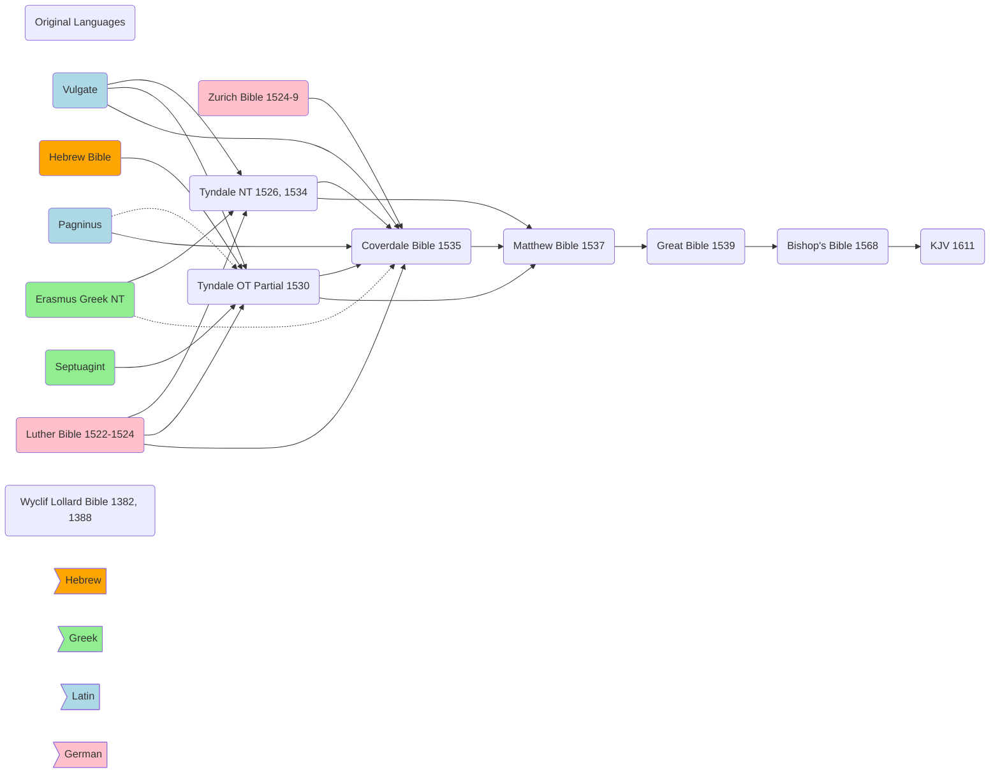

---
aliases:
  - The King James Bible
title: The King James Bible
author: David Norton
category: Bibles
publisher: Cambridge University Press
total_page: 231
publish_date: 2011-01-20
isbn10: 521851491
isbn13: 9780521851497
source: 
wishlist: 2025-04-29
acquired: 
started: 2025-06-03
finished: 
finishednotes:
---
# *[The King James Bible: A Short History from Tyndale to Today](https://www.cambridge.org/us/universitypress/subjects/religion/biblical-studies-new-testament/king-james-bible-short-history-tyndale-today)* by [[David Norton]]

`(Cambridge: Cambridge University Press, 2011), 231`

# Notes

 
<i>Contents</i>

<!-- MarkdownTOC autolink="true" -->

<!-- /MarkdownTOC -->

## Chapter 1: Predecessors
_**Summary**: _

#### Originals and Texts
- The KJV is "the most important book in English religion and culture." (1)
- The story of the KJV starts with the writing of the Hebrew Bible: "Reverence for the text and the problems of understaning it are essential background to the story of books, scholarship and men that becomes the story of the King James Bible." (2)
- The Old Testament is most of what survives of ancient Hebrew. It has a small vocabulary of 8,000 words: 1,000 occur only once, and 4/5 occur less than 20 times. (2)
- Ancient translations of the Hebrew include: Aramaic (sixth century BC), Septuagint (third century BC), Vulgate (404)
- There was little variation among Hebrew texts given their long tradition (3). But the Greek NT was later to be printed and slower to take a standard form, for example Erasmus "supplied his own Greek translation based on the Vulgate" in places: "Sometimes the results do not correspond to any Greek manuscripts, yet have remained in the Received Text." (4-5)
- Erasmus' text became known as the 'Textus Receptus', Received Text, and "there was a strong sense that the Greek text had attained a similar authenticity to that of the Hebrew." It remained the standard text into the nineteenth century. (5)
- The Textus Receptus has a special status and importance from majority attestation and traditional use, but modern textual criticism and knowledge of many more manuscripts now make it clear that this is not the closest we can get to the lost originals of the NT. (5)

#### The First Draft: William Tyndale
- The KJV translators thought of themselves as revisers of the Bishops' Bible of 1568 and Tyndale's translation, not as creators of a new translation. (7)
- "Without [[William Tyndale|Tyndale]], the English Bible would have been a different and, in all likelihood, lesser thing. Reading the KJB, we are for long stretches reading Tyndale, sometimes little revised, sometimes substantially worked over." (8)
- Tyndale "was the one who came closest to working from teh original languages alone." (8)
- Tyndale's first study was the original language text, and his primary effort was to be as true to it as possible, including keeping to its "phrase or manner of speech." (9)
- "The Bible in English shaped Protestant English-speaking culture. It was not just that the Bible was read, heart, and known: the Bible in English made the individualistic act of reading and understanding primary, creating a culture wedded to the belief that understood words were of the highest importance. Besides this, the Bible, more than any other writing in English, shaped the English language." (11)
- "The audience he had in mind did not know Latin. Latin was far less assimilated into English then than it is now. The common people would have heard much of what we take for granted as English as a foreign language only partly assimilated into their own, and they would have found Latin sentence structures very alien to their own way of talking. Any attempt to write with the eloquence of the classics would have sinned against both comprehensibility and the English languages just as much as literal translation would have." (12-13)

#### Revision, Completion of the First Draft, and More Revision: Myles Coverdale
- **1535 Coverdale Bible**: [[Myles Coverdale]] completed and revised the work begun by Tyndale, producing the first complete English printed Bible (OT, Apocrypha, and NT) in 1535. He relied on the Vulgate, Pagninus, Luther's Bible, and the 1524-9 Zurich Bible to translate 2/3 of the Bible in about a year. (14-15)
- Coverdale regarded translation as "no more than approximation to the meaning" and implies favor for a variety of translations, from his Prologue: "sure I am that there cometh more knowledge and understanding of the Scripture by their sundry translations than by all the glosses of our sophistical doctors. For that one interpreteth something obscurely in one place, the same translateth another, or else he himself, more manifestly by a more plain vocable of the same meaning in another place. Be not thou offended therefore, good reader, though one call a scribe that another calleth a lawyer... For if thou be not deceived by men's traditions, thou shalt find no more diversity between these terms than between four pence and a groat. And this manner have I used in my translation, calling it in some place penance that in another place I call repentance, and that not only because the interpreters have done so before me, but that the adversaries of the truth may see how that we abhor not this word penance, as they untruly report of us." (15, against *[[2022-11-15-Liturgiam authenticam#^cddb13]]*)
- **1537 Matthew Bible**: John Rogers (pseudonym Thomas Matthew) revised Coverdale and reverted to Tyndale for the NT and Pentateuch. 
#### The First 'Authorized' Version: The Great Bible 
- **1539 Great Bible / Cranmer Bible**: The first major revision under the English Church, done by Coverdale (Great Bible > Bishop's Bible > KJV).
- 

## Chapter 2: Drafting the King James Bible
_**Summary**: _

## Chapter 3: 'I was a translator'
_**Summary**: _

## Chapter 4: Working on the King James Bible
_**Summary**: _

## Chapter 5: 1611: the first edition
_**Summary**: _

## Chapter 6: Printing, editing and the development of a standard text
_**Summary**: _

## Chapter 7: Reputation and future
_**Summary**: _

--- 
**Topic**: The [[King James Version]]

**Source**
- *[[~New Cambridge Paragraph Bible with Apocrypha|New Cambridge Paragraph Bible with Apocrypha]]*
 ---
Created: [[2025-04-29-Tue]]
Updated: `=dateformat(this.file.mtime, "yyyy-MM-dd-ccc")`